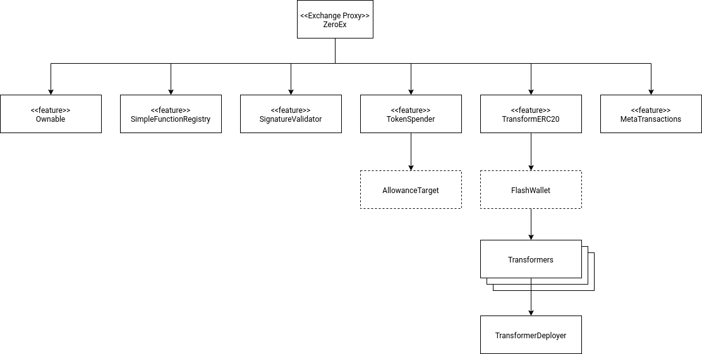

# Exchange Proxy Deployment

This document outlines procedures for deploying and upgrading the Exchange Proxy.

## Overview

The Exchange Proxy is composed of several independently deployed contracts that broadly fit into these categories:

- [Exchange Proxy](./exchange-proxy) (`ZeroEx`)
    - This is the Exchange Proxy instance itself. It serves as the entry point for all transactions, which it will reroute to the appropriate feature contract.
- [Features](./features)
    - These contracts contain the implementation code for features that will be registered to the Exchange Proxy. The Exchange Proxy will ultimately `delegatecall` into these contracts.
- Migration contracts
    - These are one-shot contracts that aid in bootstrapping/configuring the Exchange Proxy during deployment. These contracts will typically self-destruct after use.
- [Transformers](./features/transform-erc20#transformers)
    - These are the composable transformations used by the `TransformERC20` feature.
- [`TransformerDeployer`](https://github.com/0xProject/0x-monorepo/blob/development/contracts/zero-ex/contracts/src/external/TransformerDeployer.sol)
    - This is the contract that will be used to deploy the individual transformer contracts. Transformers [must](./features/transform-erc20#locking-down-transformers) be deployed by a designated address.

This diagram loosely illustrates the direct dependencies of each contract in the system.

Once these contracts are deployed, they will need to be wired together using the [`FullMigration`](https://github.com/0xProject/0x-monorepo/blob/development/contracts/zero-ex/contracts/src/migrations/FullMigration.sol) contract.

### Administration

The Exchange Proxy exposes a few admin-level functions, which are only accessible to its owner. In a production deployment, the owner would be set to the [`ZeroExGovernor`](https://github.com/0xProject/0x-protocol-specification/blob/master/v3/zero-ex-governor.md) multisig contract.

## Deployment Steps

### 1. Deploy the contracts
The following contracts need to be deployed individually. With the exception of transformers, any address may deploy these contracts.
- `FullMigration`
- `ZeroEx`
    - Passing `FullMigration.getBootstrapper()` to the constructor.
- Features:
    - `Ownable`
    - `SimpleFunctionRegistry`
    - `SignatureValidator`
    - `TokenSpender`
    - `TransformERC20`
    - `MetaTransactions`
- `TransformerDeployer`
- Transformers (deployed through `TransformerDeployer`)

### 2. Wire it all together
Afterwards, we call `FullMigration.initializeZeroEx()`. This will do several things:
- Create and configure the [`AllowanceTarget`](./features/token-spender#allowance-target) contract.
    - It will be owned by the configured owner (`ZeroExGovernor`) and the Exchange Proxy will be added as an authorized user.
- Register and initialize all the features to the Exchange Proxy.
    - The `TransformERC20` feature will deploy a new `FlashWallet` instance during initialization.
- Set the owner of the Exchange Proxy to the configured owner.
- Self-destruct.

At this point the exchange proxy is fully functional.

## Upgrades (Migrations)
Migrations will often be highly specific, depending on whether a feature is being added, removed, or replaced. Feature contracts typically implement a `migrate()` function that registers and (re)initializes the feature. This should be executed through the Exchange Proxy's *own* `migrate()` function, and must be called by the owner (`ZeroExGovernor`).

For example, if we were adding or replacing a feature, we would
1. Deploy the new feature contract `NewFeature`.
2. Call `ZeroEx.migrate(NewFeature.address, NewFeature.migrate(...).getABIEncodedTransactionData(), zeroExGovernor.owner)`
    - **Warning**: Note the last argument, which specifies the *new* owner of the Exchange Proxy. This should be set to the current owner if we do not wish to transfer ownership. Passing in an incorrect address can lock us out of administrative capability permanently.

It is highly recommended that all migrations are first attempted on a ganache fork where final state can be double-checked.
