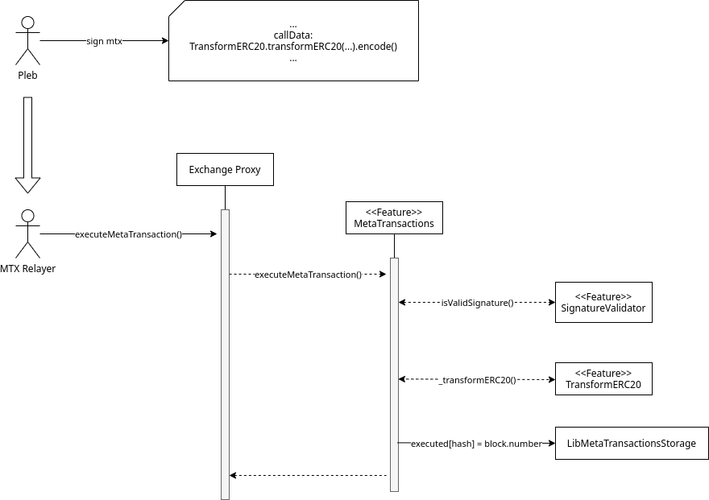

# Exchange Proxy Feature `MetaTransactions`

## Summary

A feature for executing Exchange Proxy functions on behalf of another user.

## Motivation

We want to migrate 0x-API, and therefore Matcha, away from using the V3 Exchange contract directly. To have feature parity with Exchange V3, the Exchange Proxy will need to offer comparable meta-transaction support for swaps. This spec introduces two new features to get there.

## Architecture



## Implementation

In the [V3 Exchange architecture](../../v3/v3-specification.md#transactions), we simply set a `currentContextAddress` storage variable to the meta-transaction owner then `delegatecall`ed ourselves with the provided calldata. This pattern does not work for the Exchange Proxy.

It would be pretty risky for the Exchange Proxy to `delegatecall` user-supplied calldata because there are several, sensitive “internal” functions registered to the Exchange Proxy that are guarded by an `onlySelf` modifier (`msg.sender == address(this)`). So some kind of white-list would be required.

Also, Exchange Proxy features are encouraged to expose an internal variant of functions that allow the context address to be passed explicitly. This removes the need to store the context address to storage during a meta-transaction call. However, the calldata provided is no longer what we actually execute, as we now have to manually decode the meta-transaction calldata and translate the parameters to a call to the internal variant of the target function.

### The `MetaTransaction` Object
Most of these fields are self-explanatory, but there are a couple things worth noting:
- A fee can be added to the meta-transaction, payable in any ERC20 token that `signer` has approved the Exchange Proxy's allowance target for.
- The amount of ETH to be attached to the call can be specified by `value`. It is possible for ETH to be generated by a prior meta-transaction and to be consumed by a subsequent one.
- Gas price restrictions is now a range.

```solidity
struct MetaTransactionData {
    // Signer of meta-transaction. On whose behalf we execute the MTX.
    address signer;
    // Allowed sender, or 0 for anyone.
    address sender;
    // Minimum gas price.
    uint256 minGasPrice;
    // Maximum gas price.
    uint256 maxGasPrice;
    // MTX is invalid after this time.
    uint256 expirationTimeSeconds;
    // Nonce to make this MTX unique.
    uint256 salt;
    // Call data to execute (but not really).
    // E.g., from `ITransformERC20.transformERC20(...).getABIEncodedTransactionData()`.
    bytes callData;
    // Amount of ETH to attach to the call.
    uint256 value;
    // ERC20 fee `signer` pays `sender`.
    IERC20 feeToken;
    // ERC20 fee amount.
    uint256 feeAmount;
}
```

The hash of a `MetaTransacitonData` is obtained by using [EIP712](https://github.com/ethereum/EIPs/blob/master/EIPS/eip-712.md) with the following domain:

```js
{
    name: 'ZeroEx',
    version: '1.0.0',
    chainId: 1, // For mainnet.
    verifyingConract: EXCHANGE_PROXY_ADDRESS,
}
```

### Functions
The feature exposes the following functions:
* `executeMetaTransaction()` Execute a single meta-transaction.
* `batchExecuteMetaTransactions()` Execute multiple meta-transactions in sequence.
* `_executeMetaTransaction()`Internal variant of `executeMetaTransaction()` that allows the sender to be explicitly provided.
* `getMetaTransactionHash()` Return the hash of the meta-transaction.
* `getMetaTransactionExecutedBlock()` Get the block height at which a meta-transaction was executed (0 if never executed).
* `getMetaTransactionHashExecutedBlock()` Get the block height at which a meta-transaction *has* was executed (0 if never executed).

### Signatures
Meta-transactions can be signed via any signature type supported by the [`SignatureValidator` feature](./signature-validator.md), since signature validation is entirely delegated to that feature.

### Supported Functions
Only the [`TransformERC20.transformERC20()`](./transform-erc20.md) function is currently supported.

The `MetaTransactions` feature understands [signed calldata](./transform-erc20.md#signed-calldata) to `TransformERC20.transformERC20()`. It uses the same parsing and validation library as the `TransformERC20` feature to signatures embedded in the meta-transaction's `callData` field.

### Replay Protection
When a meta-transaction executes successfully, the feature will remember the block height at which it was executed. This state will be checked again to prevent a meta-transaction from being executed twice. This state is owned by this feature.

### Reentrancy
All functions that execute meta-transactions (`executeMetaTransaction()` and `batchExecuteMetaTransactions()`) are under the same reentrancy guard.

### Value Refunds
At the end of `executeMetaTransaction()` and `batchExecuteMetaTransactions()`, any ETH held by the Exchange Proxy *up to the original `msg.value`* will be returned to the caller. This ETH will typically be unspent protocol fees from `TransformERC20.transformERC20()`.

## Integrations
A couple things to note for integrations.
- These meta-transactions only work for operations inside the Exchange Proxy (not the V3 Exchange):
- [`TransformERC20.transformERC20()`](./signature-validator.md) is the only supported function at the time of this writing.
- The allowed signature are those supported by the [`SignatureValidator`](./signature-validator.md) feature.

## Challenges
Meta-transactions still suffer from the same taker-related issues as the [TransformERC20 feature](./transform-erc20.md#rfq-models).
