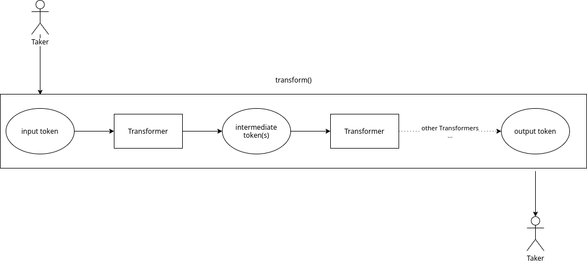
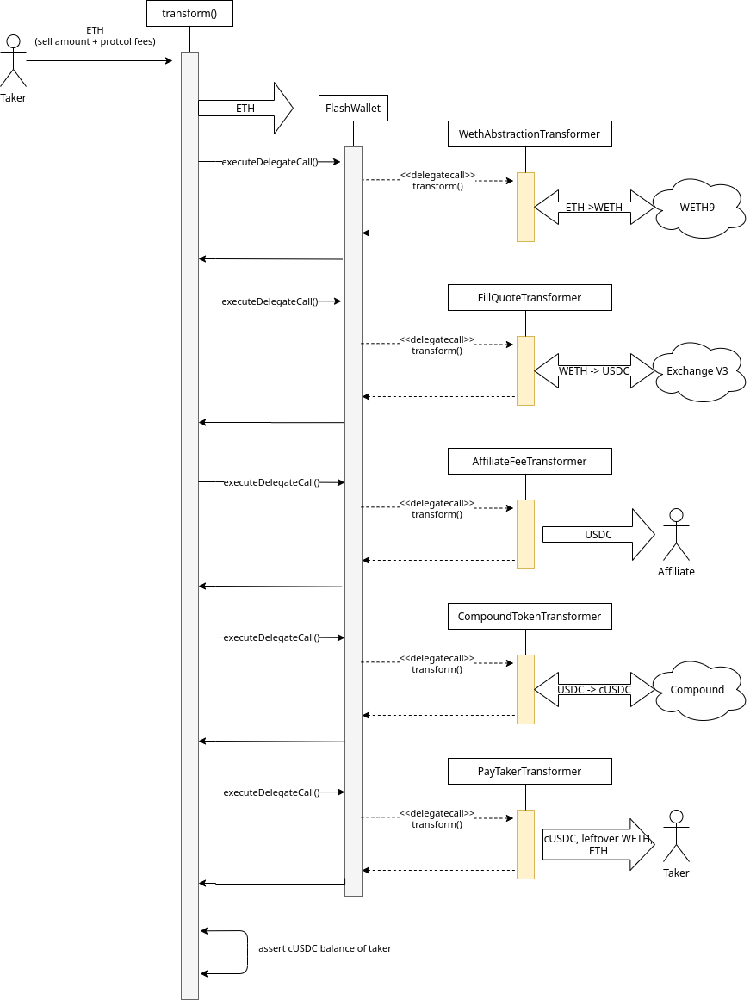

# Exchange Proxy Feature: `TransformERC20`

## Summary
A feature that allows for composable transformations between ERC20 tokens (e.g, filling quotes).

## Motivation

Integrations have taught us that there is no one-size-fits-all solution to a swap function. Different integrators will have different needs. Some prefer to interact with ETH over WETH, others want to collect affiliate fees, and we may see some that want to interact using wrapped tokens (cUSDC and the like). Therefore, we need a flexible and composable swap function that satisfies all these needs.

## Architecture

The `TransformERC20` feature exposes a `transformERC20()` function that agnostically performs a set of given "transformations" on input tokens and produces output tokens in exchange. In a nutshell it will:

1. Take X input tokens from the taker.
2. Perform arbitrary transformations (provided by the taker) on the tokens we hold.
3. Validate that the taker has received Y output tokens.

We don’t particularly care what goes on inside the transformations so long as the taker winds up receiving the required amount of output tokens at the end of it. This is similar to how [ERC20Bridges](../../asset-proxy/erc20-bridge-proxy.md) operate, in that the `ERC20BridgeProxy` does not know what the bridges are doing, but asserts at the end that the taker has received enough maker tokens

### Transformers

We define each of our desired transformations as “Transformer” contracts. Similar to bridge contracts, transformers typically receive tokens and produce some kind of “output” token (but aren’t required to do either of these). Some example transformers we could have:

* `WethTransformer`:
    * Either wraps or unwraps WETH.
* `AffiliateFeeTransformer`:
    * Transfers % of the tokens received to an affiliate address.
* `ProtocolFeeBrokerTransformer`:
    * Converts % of the tokens received into ETH, possibly by executing another swap.
* `PayTakerTransformer`:
    * Transfers tokens directly to the taker.
* `FillQuoteTransformer`:
    * Perform a market buy/sell on a set of orders, most likely generated by 0x-API.
* `CompoundTokenTransformer`:
    * Wrap/unwrap cTokens (e.g., cDAI -> DAI).

### Transformation Pipeline

`transformERC20()` executes each Transformer in sequence, manipulating the token balance held by the wallet. The final transformer will simply transfer the output token directly to the taker. This creates a composable pipeline of operations/transitions.



### Key Benefits

* Composable flexibility
    * Every integrator/taker has different needs. Allowing the taker to compose their own operations means they’re more likely to get the behavior they want.
* Rapid development
    * By separating out transformation logic from the Exchange proxy, we can iterate on these operations much more quickly.
* Peace-of-mind
    * By asserting that the taker has received the required amount of output tokens at the end, we can treat transformers as black boxes and have reasonable certainty that the taker is not being swindled.
* Novel use cases
    * The pluggable nature of this function means it is not limited to fills. One could use it to perform many common DeFi operations in a single transaction.

## Implementation

### Flash Wallets

A big difference from bridge contracts is that we `delegatecall` into transformers instead of performing a regular `call`.  This is to avoid the massive gas overhead that would be incurred if we had to transfer intermediate tokens to each transformer contract. However, we don’t want to perform the `delegatecall` in the context of the Exchange proxy because that would give transformers full control over the Exchange proxy.

So instead we use a middle-man contract called a `FlashWallet`. The wallet contract will hold all intermediate token balances and perform `delegatecall`s to the individual transformers, in a context separate from the Exchange proxy. The `TransformERC20` feature will hold a single `FlashWallet` contract instance which can be reused by `transformERC20()` all operations.

The wallet instance can be (re)created with `createTransformWallet()`, which is only callable by the owner/governor. This allows us to deploy a fresh wallet in case we somehow break the old one, like if we accidentally `selfdestruct` it or clobber its state.

The wallet also works with ERC1155 and ERC223 tokens by implementing the required fallbacks for those standards. This allows transformers to hold ERC1155 and ERC223 intermediate assets. If we decide to add support for more tokens, we will have to upgrade the `TransformERC20` feature since the FlashWallet bytecode is hardcoded into it.

#### Example

For example, if a taker wanted to do the following:

1. Pay ETH
2. Convert to WETH
3. Fill a WETH → USDC quote
4. Pay affiliate fee in USDC
5. Wrap the USDC in cUSDC

The execution might look like:



### Locking Down Transformers

Transformers need to be permissioned since they’re taking control of the wallet instance. Though no loss of funds should be able to occur in otherwise,  opening up wallets to arbitrary transformers could lead to griefing by transformers rendering the wallets unusable (e.g., `selfdestruct`).

If we maintained a registry of allowed Transformer contracts on the Exchange proxy, changes would likely have to go through the governor and be subject to timelocks, which defeats the nimbleness aspect of this entire architecture. This also incurs an `SLOAD`. Instead, we can adopt the pattern of using a single, known deployer address to deploy all Transformers. Instead of taking an address of a transformer, the `transformERC20()` function takes a “deployment nonce,” which is the nonce the trusted deployer had when deploying the transformer. The address of the transformer will be derived from this value.

A consequence of this approach is that a transformer will always be valid. If the transformer can render the state of the `FlashWallet` invalid, it can be perpetually used to grief the system. The recommendation here is to expose a self-destructing `die()` function on all transformers which:

* Is only callable by the deployer/owner.
* Checks that `address(this) == _implementation` to ensure it always self-destructs in its own context.

### Interfaces

#### Feature Interface

```solidity
interface ITransformERC20 {

    /// @dev Defines a transformation to run in `transformERC20()`.
    struct Transformation {
        // The deployment nonce of the transformer.
        // This is the nonce the deployer had when deploying the transformer.
        // The address of the transformer will be derived from this value.
        uint32 deploymentNonce;
        // Arbitrary data to pass to the transformer.
        bytes data;
    }

    /// @dev Executes a series of transformations to convert an ERC20 `inputToken`
    ///      to an ERC20 `outputToken`.
    /// @param inputToken The token being provided by the sender.
    ///        If `0xeee...`, ETH is implied and should be provided with the call.`
    /// @param outputToken The token to be acquired by the sender.
    ///        `0xeee...` implies ETH.
    /// @param inputTokenAmount The amount of `inputToken` to take from the sender.
    ///        May be `uint256(-1)` to indicate the maximum transferrable.
    /// @param minOutputTokenAmount The minimum amount of `outputToken` the sender
    ///        must receive for the entire transformation to succeed.
    /// @param transformations Sequence of transformations to apply to the token
    ///        balances.
    /// @return outputTokenAmount The amount of `outputToken` received by the sender.
    function transformERC20(
        IERC20TokenV06 inputToken,
        IERC20TokenV06 outputToken,
        uint256 inputTokenAmount,
        uint256 minOutputTokenAmount,
        Transformation[] calldata transformations
    )
        external
        payable
        returns (uint256 outputTokenAmount);

    /// @dev Arguments for `_transformERC20()`.
    struct TransformERC20Args {
        // The taker address.
        address payable taker;
        // The token being provided by the taker.
        // If `0xeee...`, ETH is implied and should be provided with the call.`
        IERC20TokenV06 inputToken;
        // The token to be acquired by the taker.
        // `0xeee...` implies ETH.
        IERC20TokenV06 outputToken;
        // The amount of `inputToken` to take from the taker.
        // If set to `uint256(-1)`, the entire spendable balance of the taker
        // will be solt.
        uint256 inputTokenAmount;
        // The minimum amount of `outputToken` the taker
        // must receive for the entire transformation to succeed. If set to zero,
        // the minimum output token transfer will not be asserted.
        uint256 minOutputTokenAmount;
        // The transformations to execute on the token balance(s)
        // in sequence.
        Transformation[] transformations;
        // The hash of the calldata for the `transformERC20()` call.
        bytes32 callDataHash;
        // The signature for `callDataHash` signed by `getQuoteSigner()`.
        bytes callDataSignature;
    }

    /// @dev Internal version of `transformERC20()`. Only callable from within.
    /// @param args A `TransformERC20Args` struct.
    /// @return outputTokenAmount The amount of `outputToken` received by the taker.
    function _transformERC20(TransformERC20Args calldata args)
        external
        payable
        returns (uint256 outputTokenAmount);
}
```

#### Transformer Interface

```solidity
/// @dev A transformation callback used in `TransformERC20.transformERC20()`.
interface IERC20Transformer {

    /// @dev Context information to pass into `transform()` by `TransformERC20.transformERC20()`.
    struct TransformContext {
        // The hash of the `TransformERC20.transformERC20()` calldata.
        bytes32 callDataHash;
        // The caller of `TransformERC20.transformERC20()`.
        address payable sender;
        // taker The taker address, which may be distinct from `sender` in the case
        // of meta-transactions.
        address payable taker;
        // Arbitrary data to pass to the transformer.
        bytes data;
    }

    /// @dev Called from `TransformERC20.transformERC20()`. This will be
    ///      delegatecalled in the context of the FlashWallet instance being used.
    /// @param context Context information.
    /// @return success The success bytes (`LibERC20Transformer.TRANSFORMER_SUCCESS`).
    function transform(TransformContext calldata context)
        external
        returns (bytes4 success);
}
```

### Signed CallData
The calldata used to execute the `transformERC20()` call (`msg.data`) can, optionally, have extra signature data appended to it. This extra data will be ignored by the EVM but will be inspected by the `transformERC20()` function prior to executing transformers. If the signature data proves that the hash of the calldata (without the signature data) is signed by `getQuoteSigner()`, the transformers will receive a non-zero `callDataHash` parameter.

The quote signer will be set to the address of the 0x-API signing key. This will allow certain transformers to "unlock" extra functionality if the quote is generated by 0x-API. Some examples of possible 0x-API-only features are:

- Gas token burning.
- Subsidizing the protocol fee.
- Filling RFQT orders.

#### Signed CallData Format

The quote signer (0x-API) would generate signed calldata as such:

```ts
export function signCallData(callData: string, privateKey: string): string {
    const {r, s, v} = ethjs.ecsign(
        ethjs.hashPersonalMessage(ethjs.toBuffer(hexUtils.hash(callData))),
        ethjs.toBuffer(privateKey),
    );
    const prefix = ethjs.keccak256('SignedCallDataSignature(bytes)');
    return hexUtils.concat(callData, prefix, v, r, s, SignatureType.EthSign);
}
```

Where `callData` is the ABI-encoded call to `transformERC20()`.

The `transformERC20()` function will search for the 4-byte `prefix` (`0xf86d1d92`) at 70 bytes from the end of `msg,data` and, if present, pass the hash of the preceding bytes and signature data to `SignatureValidator.isValidHashSignature()` to determine if the calldata was properly signed or not.


#### Quote Signer
The quote signer will be set to the address of 0x-API's signing key. The current quote signer can be accessed through `getQuoteSigner()`. It can be changed by the owner/governor through `setQuoteSigner()`.

## Data

The `transformERC20()` function will emit a `TransformedERC20` event upon completion:

```solidity
event TransformedERC20(
    address indexed taker,
    address inputToken,
    address outputToken,
    uint256 inputTokenAmount,
    uint256 outputTokenAmount
);
```

## Challenges

### RFQ Models

Because any settlement of native orders must still go through the Exchange V3 contract, the Exchange Proxy operates similar to the Forwarder contract, where it assumes the role of temporary taker for the order when performing a fill. This can be a problem for RFQ models which set the taker of the order to the address fetching the quote. Because the Exchange Proxy (actually, the `FlashWallet` instance) will be the immediate taker of the order, taker-restricted orders will not be fillable through the Exchange Proxy. To get around this, the market maker can set the taker address to the `FlashWallet` instance, but there will be no way to discriminate between actual takers at the settlement layer.
