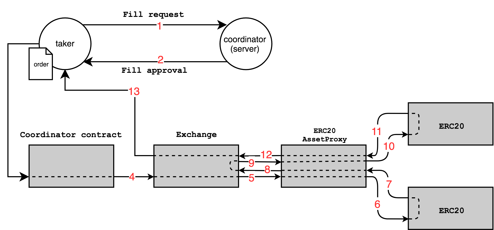

# 0x 3.0 Coordinator Specification

1.  [Architecture](#architecture)
1.  [Message Types](#message-types)
    1. [Orders](#orders)
    1. [Transactions](#transactions)
    1. [Approvals](#approvals)
1.  [Contracts](#contracts)
    1.  [Coordinator](#Coordinator)
    1.  [CoordinatorRegistry](#Coordinator-registry)
1.  [Signature Types](#signature-types)
1.  [Contract Events](#events)
1.  [Reference Coordinator Server](#reference-Coordinator-server)
1.  [Standard Coordinator API](#standard-Coordinator-api)

# Architecture

The Coordinator model leverages [0x transactions](https://github.com/0xProject/0x-protocol-specification/blob/master/v3/v3-specification.md#transactions) to interact with the [`Exchange` contract](https://github.com/0xProject/0x-protocol-specification/blob/master/v3/v3-specification.md#exchange). 0x transactions allow external accounts or contracts to execute `Exchange` methods in the context of the transaction signer, which makes it possible to add custom logic to the execution of trades or cancels.

In particular, the Coordinator model introduces an additional layer of verification to `Exchange` interactions. An order may specify a Coordinator's address that is responsible for approving any fills of the order. The Coordinator can set custom rules that may be used to prevent trade collisions, enable free and instant cancels, or add time delays to filling order.
A Coordinator has two components that differentiate it from a traditional relayer:

1. The [`Coordinator` contract](#Coordinator), an extension of the 0x protocol which verifies that transactions have been approved by the correct set of Coordinators.
1. A [Coordinator server](#reference-Coordinator-server), which approves or rejects 0x transactions under different conditions.

This specification will describe a specific implementation of each component that intends to create a market structure that is more favorable for liquidity providers while allowing liquidity to be consumed by smart contracts. See the reference server [design choices](#design-choices) section for more information. The flow for filling an order with the Coordinator model is as follows:

1. A taker selects the desired order(s) and creates a valid signed 0x transaction to fill the order(s) (e.g. `batchFillOrdersNoThrow`).
2. The taker looks up the Coordinator server endpoint(s) corresponding to the order(s) using the [Coordinator Registry](#Coordinator-registry) smart contract.
3. The taker sends a fill request with the signed 0x transaction to the Coordinator server that corresponds to each order.
4. After a 1 second delay, the Coordinator server responds with a signed approval.
5. The taker submits the signed 0x transaction and approval to the `Coordinator` contract by calling `Coordinator.executeTransaction`.
6. The `Coordinator` contract verifies that the approval is valid/unexpired and executes the 0x transaction by calling `Exchange.executeTransaction`.

<div style="text-align: center;">

</div>

# Message Types

## Orders

The [`Coordinator` contract](#Coordinator) is compatible with orders where the [`senderAddress`](https://github.com/0xProject/0x-protocol-specification/blob/master/v3/v3-specification.md#senderaddress) is equal to the address of this contract or the null address. If an order's `senderAddress` is null, that order may be filled or cancelled through the `Coordinator` contract or directly through the `Exchange` contract. For a full specification of the order schema, please see the [orders section](https://github.com/0xProject/0x-protocol-specification/blob/master/v3/v3-specification.md#orders) of the 0x 3.0 specification.

For the purposes of this specification, orders that specify the `Coordinator` contract as the `senderAddress` will be referred to as "Coordinator orders".

## Transactions

The `Coordinator` contract processes [0x transaction](https://github.com/0xProject/0x-protocol-specification/blob/master/v3/v3-specification.md#transactions) messages, using the `Exchange` 3.0 EIP712 domain header (read more [here](https://github.com/0xProject/0x-protocol-specification/blob/master/v3/v3-specification.md#transactions#hashing-a-transaction)). Transactions may be signed with any valid [0x 3.0 signature type](https://github.com/0xProject/0x-protocol-specification/blob/master/v3/v3-specification.md#signature-types).

In Solidity, a transaction is represented as:

```solidity
struct ZeroExTransaction {
    uint256 salt;                   // Arbitrary number to ensure uniqueness of transaction hash.
    uint256 expirationTimeSeconds;  // Timestamp in seconds at which transaction expires.
    uint256 gasPrice;               // gasPrice that transaction is required to be executed with.
    address signerAddress;          // Address of transaction signer.
    bytes data;                     // AbiV2 encoded calldata.
}
```

## Approvals

0x transactions that call any `Exchange` fill methods must be approved by a Coordinator. The approval includes the following fields:

| Parameter                     | Type    | Description                                                                           |
| ----------------------------- | ------- | ------------------------------------------------------------------------------------- |
| txOrigin                      | address | Address of Ethereum transaction signer that is allowed to execute this 0x transaction |
| transactionHash               | bytes32 | EIP712 hash of the 0x transaction.                                                    |
| transactionSignature          | bytes   | Signature of 0x transaction.                                                          |

In Solidity, this approval is represented as:

```solidity
struct CoordinatorApproval {
    address txOrigin;                       // Required signer of Ethereum transaction that is submitting approval.
    bytes32 transactionHash;                // EIP712 hash of the transaction.
    bytes transactionSignature;             // Signature of the 0x transaction.
}
```

The hash of an approval can be calculated with:

```solidity
// EIP191 header for EIP712 prefix
string constant internal EIP191_HEADER = "\x19\x01";

// EIP712 Domain Name value for the Coordinator
string constant internal EIP712_Coordinator_DOMAIN_NAME = "0x Protocol Coordinator";

// EIP712 Domain Version value for the Coordinator
string constant internal EIP712_Coordinator_DOMAIN_VERSION = "3.0.0";

// Hash of the EIP712 Domain Separator Schema
bytes32 constant internal EIP712_DOMAIN_SEPARATOR_SCHEMA_HASH = keccak256(abi.encodePacked(
    "EIP712Domain(",
    "string name,",
    "string version,",
    "address verifyingContract",
    ")"
));

// Hash for the EIP712 Coordinator approval message
bytes32 constant internal EIP712_Coordinator_APPROVAL_SCHEMA_HASH = keccak256(abi.encodePacked(
    "CoordinatorApproval(",
    "address txOrigin,",
    "bytes32 transactionHash,",
    "bytes transactionSignature",
    ")"
));

bytes32 EIP712_Coordinator_DOMAIN_HASH = keccak256(abi.encodePacked(
    EIP712_DOMAIN_SEPARATOR_SCHEMA_HASH,
    keccak256(bytes(EIP712_Coordinator_DOMAIN_NAME)),
    keccak256(bytes(EIP712_Coordinator_DOMAIN_VERSION)),
    uint256(address(this))
));

bytes32 hashStruct = keccak256(abi.encodePacked(
    EIP712_Coordinator_APPROVAL_SCHEMA_HASH,
    approval.txOrigin,
    approval.transactionHash,
    keccak256(approval.transactionSignature)
    approval.approvalExpirationTimeSeconds,
));

bytes32 approvalHash = keccak256(abi.encodePacked(
    EIP191_HEADER,
    EIP712_Coordinator_DOMAIN_HASH,
    hashStruct
));

```

The hash of an approval must be signed by a Coordinator in order for the approval to be valid. See the [signature types](#signature-types) section for more information on creating valid signatures.

# Contracts

## Coordinator

The `Coordinator` contract is the single entry point for executing transactions relevant to Coordinator orders.

### executeTransaction

The `Coordinator` contract contains a single function that is allowed to execute approved transactions and alter blockchain state.

When interacting with Coordinator orders, the following Exchange methods must be called through `executeTransaction` on the `Coordinator` contract:

| Method                                                                                                                                         | Approval required |
| ---------------------------------------------------------------------------------------------------------------------------------------------- | ----------------- |
| [`fillOrder`](https://github.com/0xProject/0x-protocol-specification/blob/master/v3/v3-specification.md#fillorder)                             | Yes               |
| [`fillOrKillOrder`](https://github.com/0xProject/0x-protocol-specification/blob/master/v3/v3-specification.md#fillorkillorder)                 | Yes               |
| [`batchFillOrders`](https://github.com/0xProject/0x-protocol-specification/blob/master/v3/v3-specification.md#batchfillorders)                 | Yes               |
| [`batchFillOrdersNoThrow`](https://github.com/0xProject/0x-protocol-specification/blob/master/v3/v3-specification.md#batchfillordersnothrow)   | Yes               |
| [`batchFillOrKillOrders`](https://github.com/0xProject/0x-protocol-specification/blob/master/v3/v3-specification.md#batchfillorkillorders)     | Yes               |
| [`marketBuyOrdersNoThrow`](https://github.com/0xProject/0x-protocol-specification/blob/master/v3/v3-specification.md#marketbuyordersnothrow)   | Yes               |
| [`marketBuyOrdersFillOrKill`](https://github.com/0xProject/0x-protocol-specification/blob/master/v3/v3-specification.md#marketbuyordersfillorkill)   | Yes               |
| [`marketSellOrdersNoThrow`](https://github.com/0xProject/0x-protocol-specification/blob/master/v3/v3-specification.md#marketsellordersnothrow) | Yes               |
| [`marketSellOrdersFillOrKill`](https://github.com/0xProject/0x-protocol-specification/blob/master/v3/v3-specification.md#marketsellordersfillorkill) | Yes               |
| [`matchOrders`](https://github.com/0xProject/0x-protocol-specification/blob/master/v3/v3-specification.md#matchorders)                         | Yes               |
| [`matchOrdersWithMaximalFill`](https://github.com/0xProject/0x-protocol-specification/blob/master/v3/v3-specification.md#matchorderswithmaximalfill)                         | Yes               |
| [`cancelOrder`](https://github.com/0xProject/0x-protocol-specification/blob/master/v3/v3-specification.md#cancelorder)                         | No                |
| [`batchCancelOrders`](https://github.com/0xProject/0x-protocol-specification/blob/master/v3/v3-specification.md#batchcancelorders)             | No                |
| [`cancelOrdersUpTo`](https://github.com/0xProject/0x-protocol-specification/blob/master/v3/v3-specification.md#cancelordersupto)               | No                |


Note that the `Coordinator` contract currently does not support `batchMatchOrders` or `batchMatchOrdersWithMaximalFill` transactions.

`executeTransaction` will revert under the following conditions:

- The `tx.origin` (Ethereum transaction signer) differs from the passed in `txOrigin` parameter.
- Any of the Coordinator orders include a `feeRecipientAddress` that do not have a corresponding valid signature in `approvalSignatures`.
- The transaction `expirationTimeSeconds` has passed.
- The `Exchange` function call in `transaction.data` reverts for any reason.

```solidity
/// @dev Executes a 0x transaction that has been signed by the feeRecipients that correspond to
///      each order in the transaction's Exchange calldata.
/// @param transaction 0x transaction containing salt, signerAddress, and data.
/// @param txOrigin Required signer of Ethereum transaction calling this function.
/// @param transactionSignature Proof that the transaction has been signed by the signer.
/// @param approvalSignatures Array of signatures that correspond to the feeRecipients of each
///        order in the transaction's Exchange calldata.
function executeTransaction(
    LibZeroExTransaction.ZeroExTransaction memory transaction,
    address txOrigin,
    bytes memory transactionSignature,
    bytes[] memory approvalSignatures
)
    public
    payable;
```

### assertValidCoordinatorApprovals

`assertValidCoordinatorApprovals` is a read-only helper function used for validating transaction approvals. Note that this function cannot detect failures that would occur when the 0x transaction is being executed by the `Exchange` contract.

```solidity
/// @dev Validates that the 0x transaction has been approved by all of the feeRecipients
///      that correspond to each order in the transaction's Exchange calldata.
/// @param transaction 0x transaction containing salt, signerAddress, and data.
/// @param txOrigin Required signer of Ethereum transaction calling this function.
/// @param transactionSignature Proof that the transaction has been signed by the signer.
/// @param approvalSignatures Array of signatures that correspond to the feeRecipients of each
///        order in the transaction's Exchange calldata.
function assertValidCoordinatorApprovals(
    LibZeroExTransaction.ZeroExTransaction memory transaction,
    address txOrigin,
    bytes memory transactionSignature,
    bytes[] memory approvalSignatures
)
    public
    view;
```

### getSignerAddress

`getSignerAddress` is a read-only helper function used to recover a Coordinator's address from it's signature.

```solidity
/// @dev Recovers the address of a signer given a hash and signature.
/// @param hash Any 32 byte hash.
/// @param signature Proof that the hash has been signed by signer.
/// @return signerAddress Address of the signer.
function getSignerAddress(bytes32 hash, bytes memory signature)
    public
    pure
    returns (address signerAddress);
```

### getCoordinatorApprovalHash

`getCoordinatorApprovalHash` is a read-only helper function that is used to calculate the hash of a Coordinator's approval.

```solidity
/// @dev Calculates the EIP712 hash of the Coordinator approval mesasage using the domain
///      separator of this contract.
/// @param approval Coordinator approval message containing the transaction hash, and transaction
///        signature.
/// @return approvalHash EIP712 hash of the Coordinator approval message with the domain
///         separator of this contract.
function getCoordinatorApprovalHash(CoordinatorApproval memory approval)
    public
    view
    returns (bytes32 approvalHash);
```

### decodeOrdersFromFillData

`decodeOrdersFromFillData` is a read-only helper function that is used to decode orders from any `Exchange` calldata that utilizes a fill function. Note this function will always return an empty array if data is invalid or data from an unsupported function is passed in (e.g. `batchMatchOrders` or a cancel function).

```solidity
/// @dev Decodes the orders from Exchange calldata representing any fill method.
/// @param data Exchange calldata representing a fill method.
/// @return orders The orders from the Exchange calldata.
function decodeOrdersFromFillData(bytes memory data)
    public
    pure
    returns (LibOrder.Order[] memory orders);
```

### Protocol Fees

The Coordinator contract can pay [protocol fees](https://github.com/0xProject/0x-protocol-specification/blob/master/v3/v3-specification.md#protocol-fees) in either ETH or WETH.
Any ETH that is sent in a `Coordinator.executeTransaction` will be forwarded to the `Exchange` contract. For each order filled in the transaction, the `Exchange` will attempt to pay the protocol fee using ETH, and fall back to charging WETH from the taker if there is not enough. Any ETH value left over at the end is returned to the transaction sender.

Note that if the transaction is submitted by someone besides the taker (e.g. by the Coordinator operator), the sender can subsidize the protocol fee on behalf of the taker by sending enough ETH in the `Coordinator.executeTransaction` to cover one or more orders.

## CoordinatorRegistry

The CoordinatorRegistry contract allows Coordinators to register their Coordinator API endpoints in a central contract for greater discoverability.

### setCoordinatorEndpoint

`setCoordinatorEndpoint` registers an endpoint string to the address of the sender.

```solidity
/// @dev Called by a Coordinator operator to set the endpoint of their Coordinator.
/// @param coordinatorEndpoint endpoint of the Coordinator.
function setCoordinatorEndpoint(string calldata coordinatorEndpoint)
    external;
```

### getCoordinatorEndpoint

`getCoordinatorEndpoint` is a read-only function that retrieves the endpoint of a Coordinator.

```solidity
/// @dev Gets the endpoint for a Coordinator.
/// @param coordinatorOperator Operator of the Coordinator endpoint.
/// @return coordinatorEndpoint Endpoint of the Coordinator as a string.
function getCoordinatorEndpoint(address coordinatorOperator)
    external
    view
    returns (string memory CoordinatorEndpoint);
```

# Signature Types

All signatures submitted to the `Coordinator` contract are represented as a byte array of arbitrary length, where the last byte (the "signature byte") specifies the signatures type. The signature type is read from the signature byte array before validation. The allowed Coordinator signature types are symmetric to the [Exchange signature types](https://github.com/0xProject/0x-protocol-specification/blob/master/v3/v3-specification.md#signature-types), but do not include `Wallet`, `Validator`, `PreSigned`, and `EIP1271Wallet` types. The following signature types are supported:

| Signature byte | Signature type      |
| -------------- | ------------------- |
| 0x00           | [Illegal](#illegal) |
| 0x01           | [Invalid](#invalid) |
| 0x02           | [EIP712](#eip712)   |
| 0x03           | [EthSign](#ethsign) |

## Illegal

This is the default value of the signature byte. A transaction that includes an `Illegal` signature will be reverted. Therefore, users must explicitly specify a valid signature type.

## Invalid

An `Invalid` signature will always revert, much like the `Illegal` type. An invalid signature can always be recreated and is therefore offered explicitly. This signature type is largely used for testing purposes and to create symmetry with the `Exchange` signature types.

## EIP712

An `EIP712` signature is considered valid if the address recovered from calling [`ecrecover`](https://github.com/0xProject/0x-protocol-specification/blob/master/v2/v2-specification.md#ecrecover-usage) with the given hash and decoded `v`, `r`, `s` values is the same as the specified signer. In this case, the signature is encoded in the following way:

| Offset | Length | Contents            |
| ------ | ------ | ------------------- |
| 0x00   | 1      | v (always 27 or 28) |
| 0x01   | 32     | r                   |
| 0x21   | 32     | s                   |

## EthSign

An `EthSign` signature is considered valid if the address recovered from calling [`ecrecover`](https://github.com/0xProject/0x-protocol-specification/blob/master/v2/v2-specification.md#ecrecover-usage) with the an EthSign-prefixed hash and decoded `v`, `r`, `s` values matches the specified signer.

The prefixed `msgHash` is calculated with:

```solidity
string constant ETH_PERSONAL_MESSAGE = "\x19Ethereum Signed Message:\n32";
bytes32 msgHash = keccak256(abi.encodePacked(ETH_PERSONAL_MESSAGE, hash));
```

`v`, `r`, and `s` are encoded in the signature byte array using the same scheme as [EIP712 signatures](#eip712).

# Events

## Coordinator events

No events are emitted by the `Coordinator` contract. However, orders filled through the `Coordinator` contract can be detected by filtering the `Exchange` contracts events for a `senderAddress` that matches the `Coordinator` contract's address.

## CoordinatorRegistry events

### CoordinatorEndpointSet

A `CoordinatorEndpointSet` event is emitted when a Coordinator endpoint is set.

```solidity
/// @dev Emitted when a Coordinator endpoint is set.
event CoordinatorEndpointSet(
    address coordinatorOperator,
    string coordinatorEndpoint
);
```

# Reference Coordinator Server

## Design choices

The goals of this Coordinator server implementation are to enable soft cancels and to enforce a selective delay between a fill request being received and approved. This implementation does _not_ explicitly mitigate trade collisions. However, this design has implicit benefits that may reduce the amount of collisions:

1. Fewer arbitrage opportunities should exist because of a maker's ability to quickly cancel orders. This reduces any opportunities to front-run trades.
1. All trade approvals are broadcast to all connected Websocket clients, which may be used as a signal to not attempt to fill already approved orders.

### Soft cancels

Typically, orders may only be cancelled using an on-chain method on the `Exchange` contract, such as `cancelOrder` or `cancelOrdersUpTo`. However, since Coordinator orders may only be filled with an approval from their corresponding Coordinator, they may be "soft cancelled" if the Coordinator simply refuses to accept future fill requests for that order. This allows users to cancel outstanding orders quickly and freely without any on-chain transaction. Note that users must trust that the Coordinator honor their cancel request until an order has expired or has been cancelled on-chain. However this process is made auditable with signed cancel receipts provided by the Coordinator.

### Selective delay

The Coordinator server adds a time delay between fill requests and approvals. This design decision has been made in order to give liquidity providers higher optionality and the ability to cancel stale orders more frequently (decreasing the chances of losing money on a trade). Simulations have shown this to decrease spreads, leading to a net benefit for both providers and consumers of liquidity. Note that this should also decrease profitability of Coordinator orders for arbitrageurs, which should indirectly decrease the number of trade collisions.

The delay is set to 1000ms in the reference implementation.

## State

The Coordinator server must maintain state in order to determine the validity of transaction requests.

- The server must be able to identify orders for which it has issued a cancellation receipt (e.g by storing their hashes). This information can be discarded after the order has expired or been invalidated.
- For each order with at least one approved fill, the server must store the sum of approved `takerAssetFillAmount`s for each approved taker. This information can be discarded after the order has been filled or invalidated. Note that this information should persist even if outstanding approvals that involve the order have expired.
- For each order with at least one approved fill, the server must store any outstanding approval signatures for fill transactions that contain the order.
- The server must be able to identify transactions that it has already approved (e.g by storing its hash). This information can be discarded after the transaction has been executed or expired.

## Handling fills

_Note: `matchOrders` is not currently implemented in [0x-Coordinator-server](https://github.com/0xProject/0x-Coordinator-server). The server will not generate approval signatures for a `matchOrders` request. However, the Coordinator contract still requires approval signatures for any `matchOrders` transactions. As such, `matchOrders` transactions must be executed directly through the Exchange contract._

Fill transaction requests should be rejected under the following conditions:

- The transaction is in any way invalid (incorrect formatting, signature, unsupported function, etc).
- A transaction with the same hash has already been approved.
- The taker has requested fills for an included order with total `takerAssetFillAmount`s that exceed the `takerAssetAmount` of the order. This creates a cost for requesting fills and should prevent takers from frequently requesting fills that they do not intend on executing.
- An included order has been soft cancelled.

All other fill requests must be approved by the Coordinator server exactly `SELECTIVE_DELAY_MS` milliseconds after the request is received.

When a valid transaction request has been received, the Coordinator server must broadcast a [`FILL_REQUEST_RECEIVED`](#fill_request_received) message to all connected Websocket clients. After a duration of `SELECTIVE_DELAY_MS`, the server should approve the fill request and simultaneously broadcast a [`FILL_REQUEST_APPROVED`](#fill_request_approved) message to all connected Websocket clients (if any orders contained in the transaction have not been soft cancelled in the mean time).

## Handling cancels

If a maker submits a valid signed 0x cancel transaction to the Coordinator server (a transaction containing data for `cancelOrder` or `batchCancelOrders`), the server must no longer accept any future fill requests that contain the transaction orders. The server must respond with a signed cancel receipt and simultaneously broadcast a [`CANCEL_REQUEST_ACCEPTED`](#cancel_request_accepted) message to all connected Websocket clients.

# Standard Coordinator API

In order to ensure that trading clients know how to successfully request a signature from your Coordinator server, it must strictly adhere to the following API specification. If it does not, you risk traders being unable to fill your orders.

## Errors

Unless the spec defines otherwise, errors to bad requests should respond with HTTP 4xx or status codes.

### Common error codes

| Code | Reason                               |
| ---- | ------------------------------------ |
| 400  | Bad Request – Invalid request format |
| 404  | Not found                            |
| 500  | Internal Server Error                |

### Error reporting format

```json
{
    "code": 100,
    "reason": "Validation Failed",
    "validationErrors": [
        {
            "field": "chainId",
            "code": 1003,
            "reason": "Requested chainId not supported by this coordinator"
        }
    ]
}
```

General error codes:

```
100 - Validation Failed
101 - Malformed JSON
```

Validation error codes:

```
1000 - Required field
1001 - Incorrect format
1002 - Value out of range
1003 - Unsupported option
1004 - Included order already soft-cancelled
1005 - 0x transaction decoding failed
1006 - No Coordinator orders included
1007 - Invalid 0x transaction signature
1008 - Only maker can cancel orders
1009 - Function call unsupported
1010 - Fill requests exceeded takerAssetAmount
1011 - 0x transaction already used
1012 - 0x transaction expiration time too high
```

## Rest API

### Chain Id

All requests should be able to specify a **?chainId** query param for all supported networks. For example:

```bash
curl https://api.Coordinator.com/v2/request_transaction?chainId=1

```

If the query param is not provided, it should default to **1** (mainnet).

Some networks and their Ids:

| Chain Id   | Name        |
| ---------- | ------------------- |
| 1          | Mainnet             |
| 3          | Ropsten             |
| 4          | Rinkeby             |
| 42         | Kovan               |
| 1337       | 0x Ganache snapshot |

If a certain chain is not supported, the response should **400** as specified in the [error response](#error-response) section. For example:

```json
{
    "code": 100,
    "reason": "Validation Failed",
    "validationErrors": [
        {
            "field": "signerAddress",
            "code": 1000,
            "reason": "requires property \"signerAddress\""
        }
    ]
}
```

### GET /v2/configuration

This endpoint returns the specific configurations chosen by this Coordinator server.

#### Response

```json
{
    "expirationDurationSeconds": 90,
    "selectiveDelayMs": 1000,
    "supportedchainIds": [1, 42]
}
```

### POST /v2/request_transaction

Submit a signed 0x transaction encoding either a 0x fill or cancellation. If the 0x transaction encodes a fill, the sender is requesting a Coordinator signature required to fill the order(s) on-chain. If the 0x transaction encodes an order(s) cancellation request, the sender is requesting the included order(s) to be soft-cancelled by the Coordinator.

#### Payload

```json
{
    "signedTransaction": {
        "salt": "91931100388176607230818964908525294150054490486093608484775003630125185361221",
        "signerAddress": "0xe36ea790bc9d7ab70c55260c66d52b1eca985f84",
        "data": "0x9b44d55600000000000000000000000000000000000000000000000000000000000000600000000000000000000000000000000000000000000000056bc75e2d6310000000000000000000000000000000000000000000000000000000000000000002e00000000000000000000000006ecbe1db9ef729cbe972c83fb886247691fb6beb0000000000000000000000000000000000000000000000000000000000000000000000000000000000000000e834ec434daba538cd1b9fe1582052b880bd7e630000000000000000000000000d8b0dd11f5d34ed41d556def5f841900d5b1c6b0000000000000000000000000000000000000000000000056bc75e2d6310000000000000000000000000000000000000000000000000000ad78ebc5ac62000000000000000000000000000000000000000000000000000000de0b6b3a76400000000000000000000000000000000000000000000000000000de0b6b3a7640000000000000000000000000000000000000000000000000000000000005dd343fa218e36953301f78fb3ae6b741cdde6e349968eab1cd2cf5759d25b218475877400000000000000000000000000000000000000000000000000000000000001c0000000000000000000000000000000000000000000000000000000000000022000000000000000000000000000000000000000000000000000000000000001c000000000000000000000000000000000000000000000000000000000000002200000000000000000000000000000000000000000000000000000000000000024f47261b000000000000000000000000034d402f14d58e001d8efbe6585051bf9706aa064000000000000000000000000000000000000000000000000000000000000000000000000000000000000000000000000000000000000000000000024f47261b000000000000000000000000025b8fe1de9daf8ba351890744ff28cf7dfa8f5e30000000000000000000000000000000000000000000000000000000000000000000000000000000000000000000000000000000000000000000000421bf17197838f0fdbffcfd570f949afaead3a1876e404e381e83ff9553c68baab246bec4e3bec474a260de4383f30bac17d61834f89ed137abc50691c86273e8cf203000000000000000000000000000000000000000000000000000000000000",
        "expirationTimeSeconds": "1574125782",
        "gasPrice": "1",
        "domain": {
            "verifyingContract": "0x48bacb9266a570d521063ef5dd96e61686dbe788",
            "chainId": 1337
        },
        "signature": "0x1be654974be699d87c4c92b3099ede25897793cd1c2517842050be7d69bac2965106d183e231c4a7466e8ebaf75de5464927356e8666e5a425c70ea4eb2f95d4f602"
    },
    "txOrigin": "0xe36ea790bc9d7ab70c55260c66d52b1eca985f84"
}
```

- `signedTransaction` - A signed [0x transaction](https://github.com/0xProject/0x-protocol-specification/blob/master/v3/v3-specification.md#transactions) along with the `verifyingContractAddress` which is part of it's [EIP712 domain](https://github.com/ethereum/EIPs/blob/master/EIPS/eip-712.md#definition-of-domainseparator).
- `txOrigin` - The address that will eventually submit the Ethereum transaction executing this 0x transaction on-chain. This will be enforced by the `Coordinator` extension contract.

#### Response

**Fill request response:**

```json
{
  "signatures": [
    "0x1cc07d7ae39679690a91418d46491520f058e4fb14debdf2e98f2376b3970de8512ace44af0be6d1c65617f7aae8c2364ff63f241515ee1559c3eeecb0f671d9e903"
  ]
}
```

- `signatures` - the Coordinator signatures required to submit the 0x transaction
- `expirationTimeSeconds` - when the signatures will expire and no longer be valid

Usually a single signature will be returned. Only when someone requests to batchFill multiple orders from the Coordinator that were created with different supported feeRecipientAddresses, will this return a signature per `feeRecipientAddress` involved.

**Cancellation request response:**

```json
{
    "outstandingFillSignatures": [
        {
            "orderHash": "0x5a62f9d16ac7b0db6f07bf4dd9f38111ce3079894ec248a1d703e9870f6cf467",
            "approvalSignatures": [
                "0x1bb296ace196aecda15c129feb1580c60b6589f1a147acbd4fa8e48f13c95fe0b022f1233390eebb7bd4799ebd9e1a7085c4a0e5a01a155f3476a238d2f7e83e8702"
            ],
            "expirationTimeSeconds": 1574124863,
            "takerAssetFillAmount": "100000000000000000000"
        }
    ],
    "cancellationSignatures": [
        "0x1cc8ce8e54a4f5069663433f4769555ae2f8102d819e7ef9346097f412ff47aba47023e71a4a8558968cc3820677e142da6e3316b123d3def8038d720ea468983e02"
    ]
}
```

- `outstandingFillSignatures` - Information about the outstanding signatures to fill the order(s) that have been soft-cancelled.
- `cancellationSignatures` - An approval signature of the cancellation 0x transaction submitted to the Coordinator (with the expiration hard-coded to 0 -- although these never expire). These signatures can be used to prove that a soft-cancel was granted for these order(s).

### POST /v2/soft_cancels

Within the Coordinator model, the Coordinator server is the source-of-truth when it comes to determining whether an order has been soft-cancelled. This endpoint can be used to query whether a set of orders have been soft-cancelled. The response returns the subset of orders that have been soft-cancelled.

#### Payload

```json
{
  "orderHashes": [
    "0xd1dc61f3e7e5f41d72beae7863487beea108971de678ca00d903756f842ef3ce", "0xabcc372e3812bba31a35958dc32d0beadf27595d51fb953709944559404e1b61"
  ]
}
```

#### Response

```json
{
  "orderHashes": [
    "0xabcc372e3812bba31a35958dc32d0beadf27595d51fb953709944559404e1b61"
  ]
}
```

## WebSocket API

### Transaction request notifications

#### Endpoint: `/v2/requests`

The WebSocket endpoint allows a client to subscribe to the following events:

#### FILL_REQUEST_RECEIVED

A fill request was received and is valid. The request has not yet been granted a Coordinator signature. Depending on the server implementation, the request might need to wait for a selective delay before being issued a signature.

```json
{
  "type": "FILL_REQUEST_RECEIVED",
  "data": {
    "transactionHash": "0xef5c67ee7812fba2da35958dc32d0beadf27595d51fb953709944559404e1b6b"
  }
}
```

#### FILL_REQUEST_ACCEPTED

The fill request has been accepted and a signature issued. The corresponding 0x transaction can now be executed on-chain.

```json
{
    "type": "FILL_REQUEST_ACCEPTED",
    "data": {
        "functionName": "fillOrder",
        "orders": [
            {
                "makerAddress": "0x6ecbe1db9ef729cbe972c83fb886247691fb6beb",
                "takerAddress": "0x0000000000000000000000000000000000000000",
                "feeRecipientAddress": "0xe834ec434daba538cd1b9fe1582052b880bd7e63",
                "senderAddress": "0x0d8b0dd11f5d34ed41d556def5f841900d5b1c6b",
                "makerAssetAmount": "100000000000000000000",
                "takerAssetAmount": "200000000000000000000",
                "makerFee": "1000000000000000000",
                "takerFee": "1000000000000000000",
                "expirationTimeSeconds": "1574124458",
                "salt": "48764487760552699804149717502926169713010865438911519646514105788226529910441",
                "makerAssetData": "0xf47261b000000000000000000000000034d402f14d58e001d8efbe6585051bf9706aa064",
                "takerAssetData": "0xf47261b000000000000000000000000025b8fe1de9daf8ba351890744ff28cf7dfa8f5e3",
                "makerFeeAssetData": "0xf47261b000000000000000000000000034d402f14d58e001d8efbe6585051bf9706aa064",
                "takerFeeAssetData": "0xf47261b000000000000000000000000025b8fe1de9daf8ba351890744ff28cf7dfa8f5e3",
                "exchangeAddress": "0x48bacb9266a570d521063ef5dd96e61686dbe788",
                "chainId": 1337
            }
        ],
        "txOrigin": "0xe36ea790bc9d7ab70c55260c66d52b1eca985f84",
        "signedTransaction": {
            "salt": "52126215699374006497642132602690753708829640873586153514003275723689763844211",
            "signerAddress": "0xe36ea790bc9d7ab70c55260c66d52b1eca985f84",
            "data": "0x9b44d55600000000000000000000000000000000000000000000000000000000000000600000000000000000000000000000000000000000000000056bc75e2d6310000000000000000000000000000000000000000000000000000000000000000002e00000000000000000000000006ecbe1db9ef729cbe972c83fb886247691fb6beb0000000000000000000000000000000000000000000000000000000000000000000000000000000000000000e834ec434daba538cd1b9fe1582052b880bd7e630000000000000000000000000d8b0dd11f5d34ed41d556def5f841900d5b1c6b0000000000000000000000000000000000000000000000056bc75e2d6310000000000000000000000000000000000000000000000000000ad78ebc5ac62000000000000000000000000000000000000000000000000000000de0b6b3a76400000000000000000000000000000000000000000000000000000de0b6b3a7640000000000000000000000000000000000000000000000000000000000005dd33baa6bcfb8d35d9a4a4eec6662ce5c6ce607cb2afc23368152c041f70b0d3d43dea900000000000000000000000000000000000000000000000000000000000001c0000000000000000000000000000000000000000000000000000000000000022000000000000000000000000000000000000000000000000000000000000001c000000000000000000000000000000000000000000000000000000000000002200000000000000000000000000000000000000000000000000000000000000024f47261b000000000000000000000000034d402f14d58e001d8efbe6585051bf9706aa064000000000000000000000000000000000000000000000000000000000000000000000000000000000000000000000000000000000000000000000024f47261b000000000000000000000000025b8fe1de9daf8ba351890744ff28cf7dfa8f5e30000000000000000000000000000000000000000000000000000000000000000000000000000000000000000000000000000000000000000000000421c8730c522bc20beece5549e875611f761c16f71fe175283ec6ecc322ac6efddaa2415fae2e5fe8c31f7b0bb75bcaeb8a6d533c228862edb9f48a02615e5de89cc03000000000000000000000000000000000000000000000000000000000000",
            "expirationTimeSeconds": "1574123656",
            "gasPrice": "1",
            "domain": {
                "verifyingContract": "0x48bacb9266a570d521063ef5dd96e61686dbe788",
                "chainId": 1337
            },
            "signature": "0x1cf25e8887b4b1667db73ff1e5f70265b745fc6ebfb411273d877c03406b8fb9ac7d0f7d60f52fa94a891b0781c4fb21dd8f668135f04089edd70bd3e95346207a02"
        },
        "approvalSignatures": [
            "0x1b4f6d3d2e13b9d820a38cb4248fd84319d0146bcea5c575ae799535d091dffb0622034db3404062e052900b40665afb5efb9ca5674e50ab84213f2a61577e661a02"
        ],
        "approvalExpirationTimeSeconds": 1574123656
    }
}
```

#### CANCEL_REQUEST_ACCEPTED

A cancellation request has been recevied and processed. The 0x orders included in the request have been soft-cancelled, and not additional fill signatures will be issued by the Coordinator.

```json
{
    "type": "CANCEL_REQUEST_ACCEPTED",
    "data": {
        "orders": [
            {
                "makerAddress": "0x6ecbe1db9ef729cbe972c83fb886247691fb6beb",
                "takerAddress": "0x0000000000000000000000000000000000000000",
                "feeRecipientAddress": "0xe834ec434daba538cd1b9fe1582052b880bd7e63",
                "senderAddress": "0x0d8b0dd11f5d34ed41d556def5f841900d5b1c6b",
                "makerAssetAmount": "100000000000000000000",
                "takerAssetAmount": "200000000000000000000",
                "makerFee": "1000000000000000000",
                "takerFee": "1000000000000000000",
                "expirationTimeSeconds": "1574124572",
                "salt": "42755269579020324269093211540777876831285699454511353966698673945447926716421",
                "makerAssetData": "0xf47261b000000000000000000000000034d402f14d58e001d8efbe6585051bf9706aa064",
                "takerAssetData": "0xf47261b000000000000000000000000025b8fe1de9daf8ba351890744ff28cf7dfa8f5e3",
                "makerFeeAssetData": "0xf47261b000000000000000000000000034d402f14d58e001d8efbe6585051bf9706aa064",
                "takerFeeAssetData": "0xf47261b000000000000000000000000025b8fe1de9daf8ba351890744ff28cf7dfa8f5e3",
                "exchangeAddress": "0x48bacb9266a570d521063ef5dd96e61686dbe788",
                "chainId": 1337
            }
        ],
        "transaction": {
            "salt": "74444471445328124762427213642222995677492889077503564576912432610891620698157",
            "signerAddress": "0x6ecbe1db9ef729cbe972c83fb886247691fb6beb",
            "data": "0x2da6298700000000000000000000000000000000000000000000000000000000000000200000000000000000000000006ecbe1db9ef729cbe972c83fb886247691fb6beb0000000000000000000000000000000000000000000000000000000000000000000000000000000000000000e834ec434daba538cd1b9fe1582052b880bd7e630000000000000000000000000d8b0dd11f5d34ed41d556def5f841900d5b1c6b0000000000000000000000000000000000000000000000056bc75e2d6310000000000000000000000000000000000000000000000000000ad78ebc5ac62000000000000000000000000000000000000000000000000000000de0b6b3a76400000000000000000000000000000000000000000000000000000de0b6b3a7640000000000000000000000000000000000000000000000000000000000005dd33c1c5e86a000f7cf7e3ed76798e37c8aa5be12fd0ec8d2c9c02c7923f1967d11d80500000000000000000000000000000000000000000000000000000000000001c0000000000000000000000000000000000000000000000000000000000000022000000000000000000000000000000000000000000000000000000000000001c000000000000000000000000000000000000000000000000000000000000002200000000000000000000000000000000000000000000000000000000000000024f47261b000000000000000000000000034d402f14d58e001d8efbe6585051bf9706aa064000000000000000000000000000000000000000000000000000000000000000000000000000000000000000000000000000000000000000000000024f47261b000000000000000000000000025b8fe1de9daf8ba351890744ff28cf7dfa8f5e300000000000000000000000000000000000000000000000000000000",
            "expirationTimeSeconds": "1574123771",
            "gasPrice": "1",
            "domain": {
                "verifyingContract": "0x48bacb9266a570d521063ef5dd96e61686dbe788",
                "chainId": 1337
            }
        }
    }
}

```
