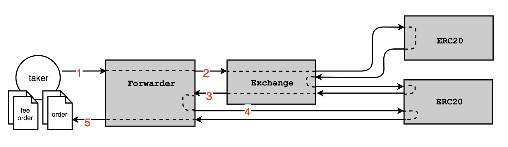

# 0x 3.0 Forwarder Specification

1.  [Architecture](#architecture)
1.  [Contracts](#contracts)
    1.  [Forwarder](#forwarder)
1.  [Contract Interactions](#contract-interactions)
    1.  [Fee Abstraction](#fee-abstraction)
1.  [Events](#events)
    1.  [Forwarder events](#forwarder-events)
1.  [Miscellaneous](#miscellaneous)
    1.  [Optimizing calldata](#optimizing-calldata)

# Architecture

<div style="text-align: center;">

</div>

The Forwarder contract acts as a middleman between a prospective taker and the 0x Exchange contract. Its purpose is to perform a number of useful actions on the taker's behalf, conveniently reducing the number of steps and transactions.

The 0x protocol [AssetProxy](https://github.com/0xProject/0x-protocol-specification/blob/master/v3/v3-specification.md#assetproxy) contracts work as operators that are authorized to move tokens on behalf of users if an order with a valid signature can be produced. Since ETH is not a token and cannot be moved natively by a third party operator, Wrapped ETH (WETH) is introduced to adapt ETH to work in this environment. WETH requires a user to deposit ETH into the WETH contract (one transaction) and approve the AssetProxy operator (a second transaction) to transfer the WETH on the user's behalf.

A user is then able to find an order and perform a TokenXYZ/WETH `fillOrder` on the 0x [Exchange contract](https://github.com/0xProject/0x-protocol-specification/blob/master/v3/v3-specification.md#exchange) (a third transaction).

For a first time token purchaser, this is non-trivial setup necessitated by the design of the ERC20 token standard. The Forwarder contract's purpose is to offload this overhead from users, enabling them to buy tokens in a single transaction.

# Contracts

The Forwarder contains all of the following logic:

- Presets approval to the [ERC20Proxy](https://github.com/0xProject/0x-protocol-specification/blob/master/v3/v3-specification.md#erc20proxy) and the [ERC721Proxy](https://github.com/0xProject/0x-protocol-specification/blob/master/v3/v3-specification.md#erc721proxy)
- Converts ETH into WETH on behalf of the user
- Performs the token exchange via the 0x Exchange contract
- Transfers the newly purchased asset to the user

The Forwarder contract has two public entry points: `marketSellOrdersWithEth` and `marketBuyOrdersWithEth`.

Both methods' implementations follow the same 4-step process:

1.  Convert ETH to WETH.
2.  Fill the orders using a market sell or buy, respectively.
3.  If a Forwarder fee recipient and fee percentage are supplied, deduct the fee from the remaining WETH balance.
4.  Convert any remaining WETH back to ETH and return it to the sender.

The Forwarder contract pays [protocol fees](https://github.com/0xProject/0x-protocol-specification/blob/master/v3/v3-specification.md#protocol-fees) using the WETH obtained in step 1. Note that WETH spent on protocol fees is included in the total `wethSpentAmount` used to compute the Forwarder fee in step 3.

As of v3, the 0x Exchange supports order fees denominated in [arbitrary tokens](https://github.com/0xProject/ZEIPs/issues/28). By consequence, the [ZRX fee abstraction](https://github.com/0xProject/0x-protocol-specification/blob/master/v2/forwarder-specification.md#fee-abstraction) has been removed from the Forwarder. Instead, `marketSellOrdersWithEth` and `marketBuyOrdersWithEth` support orders with taker fees denominated in either **WETH** or the **maker asset**. Maker fees can be denominated in any asset.

## marketBuyOrdersWithEth

This function buys a specific amount of asset (ERC20 or ERC721) given a set of TokenA/WETH orders. The user specifies the amount they wish to buy with the `makerAssetBuyAmount` parameter. `makerAssetBuyAmount` must equal 1 if buying unique ERC721 tokens. Note that the Forwarder contract does not enforce that `makerAsset` of all supplied `orders` are the same; the contract will fill the provided orders and transfer the acquired assets to the sender until the aggregate amount of assets acquired equals `makerAssetBuyAmount`.

This function will revert under the following conditions:

- No ETH value was included in the transaction
- The `makerAssetData` contains an [`assetProxyId`](https://github.com/0xProject/0x-protocol-specification/blob/master/v3/v3-specification.md#assetdata) that is not supported (currently ERC20 and ERC721 only)
- The contract attempts to fill an order with an unsupported fee (i.e. neither WETH nor the maker asset)
- The entire `makerAssetBuyAmount` cannot be bought
- The supplied `feePercentage` is greater than 5% (represented as 0.05 \* 10^18)
- The required ETH fee cannot be paid

```solidity
    /// @dev Attempt to buy makerAssetBuyAmount of makerAsset by selling ETH provided with transaction.
    ///      The Forwarder may *fill* more than makerAssetBuyAmount of the makerAsset so that it can
    ///      pay takerFees where takerFeeAssetData == makerAssetData (i.e. percentage fees).
    ///      Any ETH not spent will be refunded to sender.
    /// @param orders Array of order specifications used containing desired makerAsset and WETH as takerAsset.
    /// @param makerAssetBuyAmount Desired amount of makerAsset to purchase.
    /// @param signatures Proofs that orders have been created by makers.
    /// @param feePercentage Percentage of WETH sold that will payed as fee to forwarding contract feeRecipient.
    /// @param feeRecipient Address that will receive ETH when orders are filled.
    /// @return wethSpentAmount Amount of WETH spent on the given set of orders.
    /// @return makerAssetAcquiredAmount Amount of maker asset acquired from the given set of orders.
    /// @return ethFeePaid Amount of ETH spent on the given forwarder fee.
    function marketBuyOrdersWithEth(
        LibOrder.Order[] memory orders,
        uint256 makerAssetBuyAmount,
        bytes[] memory signatures,
        uint256 feePercentage,
        address payable feeRecipient
    )
        public
        payable
        returns (
            uint256 wethSpentAmount,
            uint256 makerAssetAcquiredAmount,
            uint256 ethFeePaid
        );
```

In order to account for partial fills that may occur while a `marketBuyOrdersWithEth` transaction is pending, one can safely provide additional orders and ETH as a buffer. The Forwarder contract will only ever purchase `makerAssetBuyAmount`, and any additional ETH is returned to the user. This allows a user to e.g. provide 100 orders and 100 ETH to purchase one token, with the guarantee that all unspent ETH will be returned. Note that any unused orders will increase the gas cost of the transaction due to the additional calldata that must be stored in the blockchain's history.

## marketSellOrdersWithEth

This function attempts to buy as many tokens as possible given the amount of ETH sent in by performing a "market sell". The WETH required to pay the Forwarder fee is set aside and the Forwarder attempts to sell the rest by filling the provided orders. Note that the Forwarder contract does not enforce that `makerAsset` of all supplied `orders` are the same, but the `makerAssetAcquiredAmount` return value might not be meaningful if different assets are acquired.

This function will revert under the following conditions:

- No ETH value was included in the transaction
- The `makerAssetData` contains an [`assetProxyId`](https://github.com/0xProject/0x-protocol-specification/blob/master/v2/v2-specification.md#assetdata) that is not supported (currently ERC20 and ERC721 only)
- The contract attempts to fill an order with an unsupported fee (i.e. neither WETH nor the maker asset)
- The supplied `feePercentage` is greater than 5% (represented as 0.05 \* 10^18)
- More ETH is sold than the value included in the transaction

```solidity
    /// @dev Purchases as much of orders' makerAssets as possible by selling as much of the ETH value sent
    ///      as possible, accounting for order and forwarder fees.
    /// @param orders Array of order specifications used containing desired makerAsset and WETH as takerAsset.
    /// @param signatures Proofs that orders have been created by makers.
    /// @param feePercentage Percentage of WETH sold that will payed as fee to forwarding contract feeRecipient.
    /// @param feeRecipient Address that will receive ETH when orders are filled.
    /// @return wethSpentAmount Amount of WETH spent on the given set of orders.
    /// @return makerAssetAcquiredAmount Amount of maker asset acquired from the given set of orders.
    /// @return ethFeePaid Amount of ETH spent on the given forwarder fee.
    function marketSellOrdersWithEth(
        LibOrder.Order[] memory orders,
        bytes[] memory signatures,
        uint256 feePercentage,
        address payable feeRecipient
    )
        public
        payable
        returns (
            uint256 wethSpentAmount,
            uint256 makerAssetAcquiredAmount,
            uint256 ethFeePaid
        );
```

## feePercentage and feeRecipient

As alluded to previously, the `feePercentage` and `feeRecipient` in `marketSellOrdersWithEth` and `marketBuyOrdersWithEth` specify a _Forwarder fee_, which is different from the _order fees_ (maker/taker fees) and _protocol fees_ required to fill any 0x order. The Forwarder fee incentivizes integrations from wallets and other dApps –– entities that otherwise wouldn't be receiving fees from 0x orders –– to host front ends for the Forwarder contract and earn revenue. The Forwarder fee is calculated as a percentage of the total value of ETH spent (including taker and protocol fees), not the total amount of ETH sent to the contract when calling the function.

`feePercentage` supports 18 decimal places of precision; for example 0.59% is represented as 0.0059 \* 10^18. This value is upper-bounded by 5%.

# Miscellaneous

## Events

There are no additional events emitted by the Forwarding contract. However, `Transfer` (ERC20 and ERC721), `Deposit` and `Withdraw` (WETH), and `Fill` (0x Exchange) are emitted in their respective contracts.

## Known Issues

### Rounding

As a byproduct of rounding, up to 1 wei worth of WETH may be oversold in the last order filled by `marketSellOrdersWithEth` (equivalently, up to 1 wei worth of maker asset may be overbought in the last order filled by  `marketBuyOrdersWithEth`).

### feePercentage and feeRecipient modifications

These values are submitted by the user and can therefore be modified. After talking with many projects, we believe this is acceptable for multiple reasons.

1.  It is possible for a wallet to copy this contract and hard code these values.
2.  If a wallet is the source of liquidity, they can filter orders by `senderAddress` or `takerAddress`.
3.  It is cheaper for an "attacker" to avoid the Forwarder contract entirely and transact directly with the 0x Exchange.
