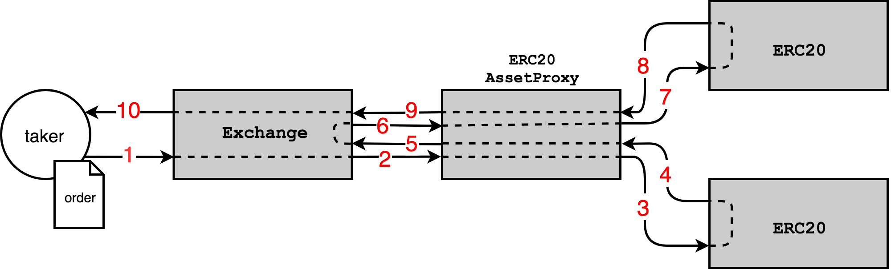
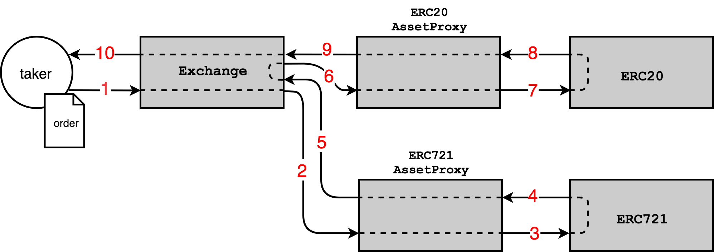

# 0x protocol 3.0 specification

## Table of contents

1.  [Architecture](#architecture)
1.  [Contracts](#contracts)
    1.  [Exchange](#exchange)
    1.  [AssetProxy](#assetproxy)
    1.  [AssetProxyOwner](#assetproxyowner)
    1.  [Staking](#staking)
1.  [Contract Interactions](#contract-interactions)
    1.  [Trade settlement](#trade-settlement)
    1.  [Protocol fees](#protocol-fees)
1.  [Orders](#orders)
    1.  [Message format](#order-message-format)
    1.  [Hashing an order](#hashing-an-order)
    1.  [Creating an order](#creating-an-order)
    1.  [Filling orders](#filling-orders)
    1.  [Matching orders](#matching-orders)
    1.  [Cancelling orders](#cancelling-orders)
    1.  [Querying state of an order](#querying-state-of-an-order)
    1.  [Simulating fill transfers](#simulating-fill-transfers)
1.  [Transactions](#transactions)
    1.  [Message format](#transaction-message-format)
    1.  [Hashing a transaction](#hashing-a-transaction)
    1.  [Creating a transaction](#creating-a-transaction)
    1.  [Executing a transaction](#executing-a-transaction)
    1.  [Transaction context](#transaction-context)
1.  [Signatures](#signatures)
    1.  [Validating signatures](#validating-signatures)
    1.  [Signature types](#signature-types)
1.  [Events](#events)
    1.  [Exchange events](#exchange-events)
    1.  [AssetProxy events](#assetproxy-events)
    1.  [AssetProxyOwner events](#assetproxyowner-events)
    1.  [Staking events](#staking-events)
1.  [Types](#types)
1.  [Rich Reverts](#rich-reverts)
1.  [Miscellaneous](#miscellaneous)
    1.  [EIP-712 usage](#eip-712-usage)
    1.  [EIP-1271 Usage](#eip-1271-usage)
    1.  [ECRECOVER usage](#ecrecover-usage)
    1.  [Rounding errors](#rounding-errors)
    1.  [Differences from 2.0](#differences-from-20)

# Architecture

0x protocol uses an approach we refer to as **off-chain order relay with on-chain settlement**. In this approach, cryptographically signed [orders](#orders) are broadcast off of the blockchain through any arbitrary communication channel; an interested counterparty may inject one or more of these [orders](#orders) into 0x protocol's [`Exchange`](#exchange) contract to execute and settle trades directly to the blockchain.

0x uses a modular system of Ethereum smart contracts which allows each component of the system to be upgraded via governance without affecting other components of the system and without causing active markets to be disrupted.

# Contracts

## Exchange

The Exchange contract contains the bulk of the business logic within 0x protocol. It is the entry point for:

1.  Filling [orders](#orders)
2.  Canceling [orders](#orders)
3.  Executing [transactions](#transactions)
4.  Validating [signatures](#signatures)
5.  Registering new [`AssetProxy`](#assetproxy) contracts into the system
6.  Paying protocol fees to the [`Staking`](#staking) contract
7.  Setting protocol fee specific parameters

## AssetProxy

The [`AssetProxy`](#assetproxy) contracts are responsible for:

1.  Decoding asset specific metadata contained within an order
2.  Performing the actual asset transfer
3.  Authorizing/unauthorizing contract addresses from calling the transfer methods on this [`AssetProxy`](#assetproxy)

In order to opt-in to using 0x protocol, users must typically approve an asset's associated [`AssetProxy`](#assetproxy) to transfer the asset on their behalf.

All [`AssetProxy`](#assetproxy) contracts have the following minimum interface:

```solidity
contract IAssetProxy {

    /// @dev Transfers assets. Either succeeds or throws.
    /// @param assetData Byte array encoded for the respective asset proxy.
    /// @param from Address to transfer asset from.
    /// @param to Address to transfer asset to.
    /// @param amount Amount of asset to transfer.
    function transferFrom(
        bytes assetData,
        address from,
        address to,
        uint256 amount
    )
        external;

    /// @dev Gets the proxy id associated with the proxy address.
    /// @return Proxy id.
    function getProxyId()
        external
        view
        returns (uint8);
}
```

Currently, the protocol includes the following [`AssetProxy`](#assetproxy) contracts:

- [`ERC20Proxy`](../asset-proxy/erc20-proxy.md)
- [`ERC721Proxy`](../asset-proxy/erc721-proxy.md)
- [`ERC1155Proxy`](../asset-proxy/erc1155-proxy.md)
- [`MultiAssetProxy`](../asset-proxy/multi-asset-proxy.md)
- [`StaticCallAssetProxy`](../asset-proxy/static-call-proxy.md)

## AssetProxyOwner

The `AssetProxyOwner` is a time-locked multi-signature wallet that has permission to perform administrative functions within the protocol. Submitted transactions must pass a 2 week timelock before they are executed. The timelock can only be bypassed to remove contract authorizations in case of emergencies (for example, if a vulnerability is discovered that puts user funds at risk).

The `AssetProxyOwner` can perform the following functions:

### Registering AssetProxy contracts

[`AssetProxy`](#assetproxy) contracts must be registered in the `Exchange` contract in order to be utilized when filling orders. The `AssetProxyOwner` can register new `AssetProxy` contracts by calling the following function:

```solidity
/// @dev Registers an asset proxy to its asset proxy id.
///      Once an asset proxy is registered, it cannot be unregistered.
/// @param assetProxy Address of new asset proxy to register.
function registerAssetProxy(address assetProxy)
    external;
```

### Managing AssetProxy contract authorizations

Most [`AssetProxy`](#assetproxy) require that the caller of their `transferFrom` function is authorized to make the call. The `AssetProxyOwner` is responsible for adding or removing authorizations (and may bypass the timelock when removing an authorization). This is also the mechanism used for upgrading the `Exchange` contract without redeploying each individual `AssetProxy`. A new `Exchange` contract can be authorized while the authorizations of old `Exchange` contracts are removed. Multiple contracts can also be simultaneously authorized.

Note that only `Exchange` contracts are currently authorized, but it is possible for other contracts to be authorized in the future. Please see the individual `AssetProxy` specifications for details on how authorizations are added and removed.

### Upgrading itself

The `AssetProxyOwner` can transfer ownership of any contract for which it is the `owner` by calling the following function:

```solidity
/// @dev Transfers ownership to a new address.
/// @param newOwner Address of the new owner.
function transferOwnership(address newOwner)
    public;
```

### Setting the protocol fee multiplier

The `AssetProxyOwner` can update the [protocol fee multiplier](#calculating-the-protocol-fee) by calling the following function:

```solidity
/// @dev Allows the owner to update the protocol fee multiplier.
/// @param updatedProtocolFeeMultiplier The updated protocol fee multiplier.
function setProtocolFeeMultiplier(uint256 updatedProtocolFeeMultiplier)
    external;
```

Setting the `protocolFeeMultiplier` will emit a [`ProtocolFeeMultiplier`](#protocolfeemultiplier) event.

### Setting the protocol fee collector

The `AssetProxyOwner` can update the protocol fee collector contract (currently the [Staking](#staking) contract) by calling the following function:

```solidity
/// @dev Allows the owner to update the protocolFeeCollector address.
/// @param updatedProtocolFeeCollector The updated protocolFeeCollector contract address.
function setProtocolFeeCollectorAddress(address updatedProtocolFeeCollector)
    external;
```

Setting the `protocolFeeCollector` will emit a [`ProtocolFeeCollectorAddress`](#protocolfeecollectoraddress) event.

TODO: add staking contract functions
TODO: update with new `AssetProxyOwner`

## Staking

TODO: link to staking spec

# Contract Interactions

The diagrams provided below demonstrate interactions between various 0x smart contracts that make up the system. The arrow represents execution context within the EVM as a transaction is processed. Execution context is passed from the originating Ethereum account (circle) and between 0x's Ethereum smart contracts (rectangles) as they make external function calls into each other. Arrows are directed from the caller to the callee. Pseudocode is provided alongside each diagram to demonstrate what is happening at each step in the sequence of external function calls that occur during a given transaction.

## Trade settlement

A trade is initiated when an [order](#orders) is passed into the [`Exchange`](#exchange) contract. If the [order](#orders) is valid, the [`Exchange`](#exchange) contract will attempt to settle each leg of the trade by calling into the appropriate [`AssetProxy`](#assetproxy) contract for each asset being exchanged. Each [`AssetProxy`](#assetproxy) accepts and processes a payload of asset metadata and initiates a transfer. To simplify the trade settlement diagrams below, we assume that the orders being settled have zero fees.

### ERC20 <> ERC20

<div style="text-align: center;">

</div>

Transaction #1

1.  `Exchange.fillOrder(order, value)`
2.  `ERC20Proxy.transferFrom(assetData, from, to, value)`
3.  `ERC20Token(assetData.address).transferFrom(from, to, value)`
4.  ERC20Token: (revert on failure)
5.  ERC20Proxy: (revert on failure)
6.  `ERC20Proxy.transferFrom(assetData, from, to, value)`
7.  `ERC20Token(assetData.address).transferFrom(from, to, value)`
8.  ERC20Token: (revert on failure)
9.  ERC20Proxy: (revert on failure)
10. Exchange: (return [`FillResults`](#fillresults))

### ERC20 <> ERC721

<div style="text-align: center;">

</div>

Transaction #1

1.  `Exchange.fillOrder(order, value)`
2.  `ERC721Proxy.transferFrom(assetData, from, to, value)`
3.  `ERC721Token(assetData.address).transferFrom(from, to, assetData.tokenId)`
4.  ERC721Token: (revert on failure)
5.  ERC721Proxy: (revert on failure)
6.  `ERC20Proxy.transferFrom(assetData, from, to, value)`
7.  `ERC20Token(assetData.address).transferFrom(from, to, value)`
8.  ERC20Token: (revert on failure)
9.  ERC20Proxy: (revert on failure)
10. Exchange: (return [`FillResults`](#fillresults))

## Protocol fees

Every individual fill executed through the `Exchange` contract charges a protocol fee to the taker that is used to incentivize liquidity provision in the system.

A detailed paper explaining the economics of protocol fees in 0x protocol can be found [here](./protocol-fees.pdf).

### Calculating the protocol fee

The protocol fee can be calculated with `tx.gasprice * protocolFeeMultiplier`, where the `protocolFeeMultiplier` is an upgradable value meant to target a percentage of the gas used for filling a single order. The suggested initial value for the `protocolFeeMultiplier` is `150000`, which is roughly equal to the average gas cost of filling a single order (thereby doubling the net average cost).

### Protocol fee denomination

The protocol fee can be paid in either ETH or its [WETH](https://weth.io/) equivalent (denominated in wei). If it is not provided as value included in the message call, the [`Staking`](#staking) contract will attempt to transfer WETH from the taker's address to cover the fee instead. The `Exchange` contract assumes that the fee was correctly paid if the `Staking` contract's `payProtocolFee` function did not revert.

TODO: add diagram
TODO: add more detail after staking spec is added

# Orders

## Order message format

An order message consists of the following parameters:

| Parameter                       | Type    | Description                                                                                                                                  |
| ------------------------------- | ------- | -------------------------------------------------------------------------------------------------------------------------------------------- |
| makerAddress                    | address | Address that created the order.                                                                                                              |
| takerAddress                    | address | Address that is allowed to fill the order. If set to 0, any address is allowed to fill the order.                                            |
| feeRecipientAddress             | address | Address that will receive fees when order is filled.                                                                                         |
| [senderAddress](#senderaddress) | address | Address that is allowed to call Exchange contract methods that affect this order. If set to 0, any address is allowed to call these methods. |
| makerAssetAmount                | uint256 | Amount of makerAsset being offered by maker. Must be greater than 0.                                                                         |
| takerAssetAmount                | uint256 | Amount of takerAsset being bid on by maker. Must be greater than 0.                                                                          |
| makerFee                        | uint256 | Amount of makerFeeAsset paid to feeRecipient by maker when order is filled. If set to 0, no fee payment to feeRecipient will be attempted.   |
| takerFee                        | uint256 | Amount of takerFeeAsset paid to feeRecipient by taker when order is filled. If set to 0, no fee payment feeRecipient will be attempted.      |
| expirationTimeSeconds           | uint256 | Timestamp in seconds at which order expires.                                                                                                 |
| [salt](#salt)                   | uint256 | Arbitrary number to facilitate uniqueness of the order's hash.                                                                               |
| [makerAssetData](#assetdata)    | bytes   | ABIv2 encoded data that can be decoded by a specified proxy contract when transferring makerAsset.                                           |
| [takerAssetData](#assetdata)    | bytes   | ABIv2 encoded data that can be decoded by a specified proxy contract when transferring takerAsset.                                           |
| [makerFeeAssetData](#assetdata) | bytes   | ABIv2 encoded data that can be decoded by a specified proxy contract when transferring makerFeeAsset.                                        |
| [takerFeeAssetData](#assetdata) | bytes   | ABIv2 encoded data that can be decoded by a specified proxy contract when transferring takerFeeAsset.                                        |

### senderAddress

If the `senderAddress` of an order is not set to 0, only that address may call [`Exchange`](#exchange) contract methods that affect that order. In other words, the `senderAddress` _must_ be the `msg.sender` of the call in order to fill or cancel these orders. If the `senderAddress` is set to a contract, that contract must enable any functions that it wishes to use in combination with the order (including cancellations). The contract can do so by explicitly calling the relevant `Exchange` functions, by calling [`executeTransaction`](#executetransaction), or by calling [`batchExecuteTransactions`](#batchexecutetransactions).

### salt

An order's `salt` parameter has two main usecases:

- To ensure uniqueness within an order's hash.
- To be used in combination with [`cancelOrdersUpTo`](#cancelordersupto). When creating an order, the `salt` value _should_ be equal to the value of the current timestamp in milliseconds. This allows maker to create 1000 orders with the same parameters per second. Note that although this is part of the protocol specification, there is currently no way to enforce this usage and `salt` values should _not_ be relied upon as a source of truth.

### assetData

The `makerAssetData` and `takerAssetData` fields of an order contain information specific to that asset. These fields are encoded using [ABIv2](http://solidity.readthedocs.io/en/latest/abi-spec.html) with a 4 byte id that references the proxy that is intended to decode the data. See the [`AssetProxy`](#assetproxy) specifications for the exact expected encoding of the `assetData` fields that correspond to each `AssetProxy` contract.

## Hashing an order

The hash of an order is used as a unique identifier of that order. An order is hashed according to the [EIP-712 specification](#https://github.com/ethereum/EIPs/pull/712/files). See the [EIP-712 Usage](#eip-712-usage) section for information on how to calculate the required domain separator for hashing an order.

```solidity
// EIP191 header for EIP712 prefix
string constant internal EIP191_HEADER = "\x19\x01";

// 0xf80322eb8376aafb64eadf8f0d7623f22130fd9491a221e902b713cb984a7534
bytes32 constant EIP712_ORDER_SCHEMA_HASH = keccak256(abi.encodePacked(
    "Order(",
    "address makerAddress,",
    "address takerAddress,",
    "address feeRecipientAddress,",
    "address senderAddress,",
    "uint256 makerAssetAmount,",
    "uint256 takerAssetAmount,",
    "uint256 makerFee,",
    "uint256 takerFee,",
    "uint256 expirationTimeSeconds,",
    "uint256 salt,",
    "bytes makerAssetData,",
    "bytes takerAssetData,",
    "bytes makerFeeAssetData,",
    "bytes takerFeeAssetData",
    ")"
));

bytes32 orderStructHash = keccak256(abi.encodePacked(
    EIP712_ORDER_SCHEMA_HASH,
    uint256(order.makerAddress),
    uint256(order.takerAddress),
    uint256(order.feeRecipientAddress),
    uint256(order.senderAddress),
    order.makerAssetAmount,
    order.takerAssetAmount,
    order.makerFee,
    order.takerFee,
    order.expirationTimeSeconds,
    order.salt,
    keccak256(order.makerAssetData),
    keccak256(order.takerAssetData),
    keccak256(order.makerFeeAssetData),
    keccak256(order.takerFeeAssetData)
));

bytes32 orderHash = keccak256(abi.encodePacked(
    EIP191_HEADER,
    EIP712_EXCHANGE_DOMAIN_HASH,
    orderStructHash
));
```

## Creating an order

An order may only be filled if it can be paired with an associated valid signature. An order's hash must be signed with a [supported signature type](#signature-types).

## Filling orders

Orders can be filled by calling the following methods on the `Exchange` contract. Note that a [protocol fee](#protocol-fees) is charged for each individual fill.

### fillOrder

This is the most basic way to fill an order. All of the other methods call `fillOrder` under the hood with additional logic. This function will attempt to fill the amount specified by the caller. However, if the remaining fillable amount is less than the amount specified, the remaining amount will be filled. Partial fills are allowed when filling orders.

```solidity
/// @dev Fills the input order.
/// @param order Order struct containing order specifications.
/// @param takerAssetFillAmount Desired amount of takerAsset to sell.
/// @param signature Proof that order has been created by maker.
/// @return Amounts filled and fees paid by maker and taker.
function fillOrder(
    LibOrder.Order memory order,
    uint256 takerAssetFillAmount,
    bytes memory signature
)
    public
    payable
    returns (LibFillResults.FillResults memory fillResults);
```

#### Logic

Calling `fillOrder` will perform the following steps:

1. Query the state and status of the order
1. Revert if the order is unfillable (invalid context, expired, cancelled, fully filled, invalid signature)
1. Calculate the [`FillResults`](#fillresults) using the minimum of the `takerAssetFillAmount` and the remaining fillable amount of the order
1. Update the state of the order and log a [`Fill`](#fill) event
1. Transfer `fillResults.takerAssetFilledAmount` of `takerAsset` from the taker to the maker
1. Transfer `fillResults.makerAssetFilledAmount` of the `makerAsset` from the maker to the taker
1. Transfer `fillResults.takerFeePaid` of the `takerFeeAsset` from the taker to the fee recipient
1. Transfer `fillResults.makerFeePaid` of the `makerFeeAsset` from the maker to the fee recipient
1. Pay a protocol fee from the taker to the [`Staking` contract](#staking) and attribute the fee to the maker
1. Refund any unused value (ETH) that was sent with the message call (note: this step will be disabled when called by any functions that wrap `fillOrder`)

Note that the ordering of transfers matters because intermediate balances may be used for later transfers.

#### Errors

`fillOrder` may revert with any of the following errors, in addition to any errors specified in the [validating signatures](#validationg-signatures) section.

| Error                                                       | Condition                                                                                                                                  |
| ----------------------------------------------------------- | ------------------------------------------------------------------------------------------------------------------------------------------ |
| [IllegalReentrancyError](#illegalreentrancyerror)           | Reentrancy is attempted                                                                                                                    |
| [OrderStatusError](#orderstatuserror)                       | The order is expired, cancelled, fully filled, or malformed                                                                                |
| [ExchangeInvalidContextError](#exchangeinvalidcontexterror) | `msg.sender` is not equal to `order.senderAddress` or taker of the fill is not equal to `order.takerAddress`, if either are specified      |
| [SignatureError](#signatureerror)                           | Signature validation returned false                                                                                                        |
| [AssetProxyDispatchError](#assetproxydispatcherror)         | An `AssetProxy` is not specified or does not exist an `assetData` field in the order                                                       |
| [AssetProxyTransferError](#assetproxytransfererror)         | The `assetProxy.transferFrom` call was unsuccessful                                                                                        |
| [RoundingError](#roundingerror)                             | Calculating the `makerAssetFilledAmount`, `makerFeePaid`, or `takerFeePaid` resulted in a rounding error >= 0.1%                           |
| [Uint256BinOpError](#uint256binoperror)                     | Multiplication resulted in an overflow when calculating the `makerAssetFilledAmount`, `makerFeePaid`, `takerFeePaid`, or `protocolFeePaid` |
| [PayProtocolFeeError](#payprotocolfeeerror)                 | The protocol fee payment was unsuccessful                                                                                                  |

### fillOrKillOrder

`fillOrKillOrder` can be used to fill an order while guaranteeing that the specified amount will either be filled or the call will revert.

```solidity
/// @dev Fills the input order. Reverts if exact takerAssetFillAmount not filled.
/// @param order Order struct containing order specifications.
/// @param takerAssetFillAmount Desired amount of takerAsset to sell.
/// @param signature Proof that order has been created by maker.
function fillOrKillOrder(
    LibOrder.Order memory order,
    uint256 takerAssetFillAmount,
    bytes memory signature
)
    public
    payable
    returns (LibFillResults.FillResults memory fillResults);
```

#### Logic

Calling `fillOrKillOrder` will perform the following steps:

1. Call `fillOrder` with the passed in inputs
1. Revert if `fillResults.takerAssetFillAmount` does not equal the passed in `takerAssetFillAmount`
1. Refund any unused value (ETH) that was sent with the message call

#### Errors

`fillOrKillOrder` may revert with any of the following errors, in addition to any errors specified in the [`fillOrder`](#fillorder) section.

| Error                                       | Condition                                                                        |
| ------------------------------------------- | -------------------------------------------------------------------------------- |
| [IncompleteFillError](#incompletefillerror) | The amount of `takerAsset` filled did not match the amount attempted fill amount |

### batchFillOrders

`batchFillOrders` can be used to fill multiple orders in a single transaction.

```solidity
/// @dev Executes multiple calls of fillOrder.
/// @param orders Array of order specifications.
/// @param takerAssetFillAmounts Array of desired amounts of takerAsset to sell in orders.
/// @param signatures Proofs that orders have been created by makers.
/// @return Array of amounts filled and fees paid by makers and taker.
function batchFillOrders(
    LibOrder.Order[] memory orders,
    uint256[] memory takerAssetFillAmounts,
    bytes[] memory signatures
)
    public
    payable
    returns (LibFillResults.FillResults[] memory fillResults);
```

#### Logic

Calling `batchFillOrders` will perform the following steps:

1. Sequentially call `fillOrder` for each element of `orders`, passing in the order, fill amount, and signature at the same index
1. Refund any unused value (ETH) that was sent with the message call

#### Errors

`batchFillOrKillOrders` may revert with any errors specified in the [`fillOrder`](#fillorder) section.

### batchFillOrKillOrders

`batchFillOrKillOrders` can be used to fill multiple orders in a single transaction while guaranteeing that the specified amounts will either be filled or the call will revert.

```solidity
/// @dev Executes multiple calls of fillOrKill.
/// @param orders Array of order specifications.
/// @param takerAssetFillAmounts Array of desired amounts of takerAsset to sell in orders.
/// @param signatures Proofs that orders have been created by makers.
/// @return Array of amounts filled and fees paid by makers and taker.
function batchFillOrKillOrders(
    LibOrder.Order[] memory orders,
    uint256[] memory takerAssetFillAmounts,
    bytes[] memory signatures
)
    public
    payable
    returns (LibFillResults.FillResults[] memory fillResults);
```

#### Logic

Calling `batchFillOrKillOrders` will perform the following steps:

1. Sequentially call `fillOrKillOrder` for each element of `orders`, passing in the order, fill amount, and signature at the same index
1. Refund any unused value (ETH) that was sent with the message call

#### Errors

`batchFillOrKillOrders` may revert with any errors specified in the [`fillOrKillOrder`](#fillorkillorder) section.

### batchFillOrdersNoThrow

`batchFillOrdersNoThrow` can be used to fill multiple orders in a single transaction while guaranteeing that no individual fill throws an error (which would typically cause the entire function call to fail).

```solidity
/// @dev Executes multiple calls of fillOrder. If any fill reverts, the error is caught and ignored.
/// @param orders Array of order specifications.
/// @param takerAssetFillAmounts Array of desired amounts of takerAsset to sell in orders.
/// @param signatures Proofs that orders have been created by makers.
/// @return Array of amounts filled and fees paid by makers and taker.
function batchFillOrdersNoThrow(
    LibOrder.Order[] memory orders,
    uint256[] memory takerAssetFillAmounts,
    bytes[] memory signatures
)
    public
    payable
    returns (LibFillResults.FillResults[] memory fillResults);
```

#### Logic

Calling `batchFillOrdersNoThrow` will perform the following steps:

1. For each element of `orders`:
   1. Call `fillOrder`, passing in the order, fill amount, and signature at the same index
   1. If the `fillOrder` call reverts, return an empty `fillResults` instead
1. Refund any unused value (ETH) that was sent with the message call

#### Errors

`batchFillOrdersNoThrow` will never revert with an error under normal conditions (the Ethereum transaction is encoded properly and has enough gas to execute).

### marketSellOrdersNoThrow

`marketSellOrderNoThrow` can be used to sell a specified amount of an asset by filling multiple orders while guaranteeing that no individual fill throws an error. Note that this function does not enforce that the asset being sold is the same in each order, as there may be cases where filling multiple similar assets is desired (i.e with stablecoins of equivalent value). The input orders should typically be sorted from best to worst price.

```solidity
/// @dev Executes multiple calls of fillOrder until total amount of takerAsset is sold by taker.
///      If any fill reverts, the error is caught and ignored.
///      NOTE: This function does not enforce that the takerAsset is the same for each order.
/// @param orders Array of order specifications.
/// @param takerAssetFillAmount Desired amount of takerAsset to sell.
/// @param signatures Proofs that orders have been signed by makers.
/// @return Amounts filled and fees paid by makers and taker.
function marketSellOrdersNoThrow(
    LibOrder.Order[] memory orders,
    uint256 takerAssetFillAmount,
    bytes[] memory signatures
)
    public
    payable
    returns (LibFillResults.FillResults memory fillResults);
```

#### Logic

Calling `marketSellOrdersNoThrow` will perform the following steps:

1. For each element of `orders`:
   1. Calculate the `remainingTakerAssetFillAmount` that has yet to be filled
   1. Call `fillOrder`, passing in the order, the `remainingTakerAssetFillAmount`, and the signature at the same index
   1. If the `fillOrder` call reverts, return an empty `fillResults` instead
   1. Add the returned `fillResults` to the total `fillResults`
   1. Exit the loop if the total `takerAssetFilledAmount` is greater than or equal to the `takerAssetFillAmount` specified as an input
1. Refund any unused value (ETH) that was sent with the message call

#### Errors

`marketSellOrdersNoThrow` can only revert with an error under one rare condition:

| Error                                   | Condition                                                            |
| --------------------------------------- | -------------------------------------------------------------------- |
| [Uint256BinOpError](#uint256binoperror) | The addition of `fillResults` from each fill resulted in an overflow |

### marketBuyOrdersNoThrow

`marketBuyOrdersNoThrow` can be used to purchase a specified amount of an asset by filling multiple orders while guaranteeing that no individual fill throws an error. Note that this function does not enforce that the asset being purchased is the same in each order, as there may be cases where filling multiple similar assets is desired (i.e with stablecoins of equivalent value). The input orders should typically be sorted from best to worst price.

```solidity
/// @dev Executes multiple calls of fillOrder until total amount of makerAsset is bought by taker.
///      If any fill reverts, the error is caught and ignored.
///      NOTE: This function does not enforce that the makerAsset is the same for each order.
/// @param orders Array of order specifications.
/// @param makerAssetFillAmount Desired amount of makerAsset to buy.
/// @param signatures Proofs that orders have been signed by makers.
/// @return Amounts filled and fees paid by makers and taker.
function marketBuyOrdersNoThrow(
    LibOrder.Order[] memory orders,
    uint256 makerAssetFillAmount,
    bytes[] memory signatures
)
    public
    payable
    returns (LibFillResults.FillResults memory fillResults);
```

#### Logic

Calling `marketBuyOrdersNoThrow` will perform the following steps:

1. For each element of `orders`:
   1. Calculate the `remainingTakerAssetFillAmount` that has yet to be filled
   1. Call `fillOrder`, passing in the order, the `remainingTakerAssetFillAmount`, and the signature at the same index
   1. If the `fillOrder` call reverts, return aan empty `fillResults` instead
   1. Add the returned `fillResults` to the total `fillResults`
   1. Exit the loop if the total `makerAssetFilledAmount` is greater than or equal to the `makerAssetFillAmount` specified as an input
1. Refund any unused value (ETH) that was sent with the message call

#### Errors

`marketBuyOrdersNoThrow` can only revert with an error under one rare condition:

| Error                                   | Condition                                                            |
| --------------------------------------- | -------------------------------------------------------------------- |
| [Uint256BinOpError](#uint256binoperror) | The addition of `fillResults` from each fill resulted in an overflow |

### marketSellOrdersFillOrKill

`marketSellOrdersFillOrKill` can be used to sell a specified amount of an asset by filling multiple orders while guaranteeing that no individual fill throws an error. However, if the entire amount is not sold then the call will revert. Note that this function does not enforce that the asset being sold is the same in each order, as there may be cases where filling multiple similar assets is desired (i.e with stablecoins of equivalent value). The input orders should typically be sorted from best to worst price.

```solidity
/// @dev Calls marketSellOrdersNoThrow then reverts if < takerAssetFillAmount has been sold.
///      NOTE: This function does not enforce that the takerAsset is the same for each order.
/// @param orders Array of order specifications.
/// @param takerAssetFillAmount Minimum amount of takerAsset to sell.
/// @param signatures Proofs that orders have been signed by makers.
/// @return Amounts filled and fees paid by makers and taker.
function marketSellOrdersFillOrKill(
    LibOrder.Order[] memory orders,
    uint256 takerAssetFillAmount,
    bytes[] memory signatures
)
    public
    payable
    returns (LibFillResults.FillResults memory fillResults);
```

#### Logic

Calling `marketSellOrdersFillOrKill` will perform the following steps:

1. Call `marketSellOrdersNoThrow` with the passed in inputs
1. Revert if `fillResults.takerAssetFillAmount` does not equal the passed in `takerAssetFillAmount`

#### Errors

`marketSellOrdersFillOrKill` may revert with any of the following errors, in addition to any errors specified in the [`marketSellOrdersNoThrow`](#marketsellordersnothrow) section.

| Error                                       | Condition                                                                        |
| ------------------------------------------- | -------------------------------------------------------------------------------- |
| [IncompleteFillError](#incompletefillerror) | The amount of `takerAsset` filled did not match the amount attempted fill amount |

### marketBuyOrdersFillOrKill

`marketBuyOrdersFillOrKill` can be used to purchase a specified amount of an asset by filling multiple orders while guaranteeing that no individual fill throws an error. However, if the entire amount is not purchased then the call will revert. Note that this function does not enforce that the asset being purchased is the same in each order, as there may be cases where filling multiple similar assets is desired (i.e with stablecoins of equivalent value). The input orders should typically be sorted from best to worst price.

```solidity
/// @dev Calls marketBuyOrdersNoThrow then reverts if < makerAssetFillAmount has been bought.
///      NOTE: This function does not enforce that the makerAsset is the same for each order.
/// @param orders Array of order specifications.
/// @param makerAssetFillAmount Minimum amount of makerAsset to buy.
/// @param signatures Proofs that orders have been signed by makers.
/// @return Amounts filled and fees paid by makers and taker.
function marketBuyOrdersFillOrKill(
    LibOrder.Order[] memory orders,
    uint256 makerAssetFillAmount,
    bytes[] memory signatures
)
    public
    payable
    returns (LibFillResults.FillResults memory fillResults);
```

#### Logic

Calling `marketBuyOrdersFillOrKill` will perform the following steps:

1. Call `marketBuyOrdersNoThrow` with the passed in inputs
1. Revert if `fillResults.makerAssetFilledAmount` does not equal the passed in `makerAssetFilledAmount`

#### Errors

`marketBuyOrdersFillOrKill` may revert with any of the following errors, in addition to any errors specified in the [`marketBuyOrdersNoThrow`](#marketbuyordersnothrow) section.

| Error                                       | Condition                                                                        |
| ------------------------------------------- | -------------------------------------------------------------------------------- |
| [IncompleteFillError](#incompletefillerror) | The amount of `takerAsset` filled did not match the amount attempted fill amount |

## Matching orders

In some special cases, multiple orders can be simultaneously filled without requiring a taker to hold any assets upfront. We refer to this as "matching" orders, though the end result is the same as if the orders had been filled. Note that a [protocol fee](#protocol-fees) is still charged per fill (or twice per match).

2 orders can only be matched together if they satisfy the following properties:

1. `leftOrder.makerAssetData == rightOrder.takerAssetData`
1. `leftOrder.takerAssetData == rightOrder.makerAssetData`
1. `(leftOrder.makerAssetAmount * rightOrder.makerAssetAmount) >= (leftOrder.takerAssetAmount * rightOrder.takerAssetAmount)`

In other words, the 2 orders must represent a bid and an ask for the _exactly_ same asset pair and have a negative spread (or at the same price).

TODO: add charts from ZEIP

### matchOrders

`matchOrders` can be used to atomically fill 2 orders without requiring the taker to hold any capital. This function is optimized for arbitrageurs in that it maximizes profit rather than maximizing the amount filled in each order. After a successful match, the taker will receive a spread denominated in the `makerAsset` of the left order only (net of any taker fees or protocol fees).

```solidity
/// @dev Match two complementary orders that have a profitable spread.
///      Each order is filled at their respective price point. However, the calculations are
///      carried out as though the orders are both being filled at the right order's price point.
///      The profit made by the left order goes to the taker (who matched the two orders).
/// @param leftOrder First order to match.
/// @param rightOrder Second order to match.
/// @param leftSignature Proof that order was created by the left maker.
/// @param rightSignature Proof that order was created by the right maker.
/// @return matchedFillResults Amounts filled and fees paid by maker and taker of matched orders.
function matchOrders(
    LibOrder.Order memory leftOrder,
    LibOrder.Order memory rightOrder,
    bytes memory leftSignature,
    bytes memory rightSignature
)
    public
    payable
    returns (LibFillResults.MatchedFillResults memory matchedFillResults);
```

#### Logic

Calling `matchOrders` will perform the following steps:

1. Set the `makerAssetData` of the right order to the `takerAssetData` of the left order
1. Set the `takerAssetData` of the right order to the `makerAssetData` of the left order
1. Query the state and status of both orders
1. Revert if either order is unfillable (invalid context, expired, cancelled, fully filled, invalid signature)
1. Revert if the orders do not have the same price or a negative spread
1. Calculate the [`MatchedFillResults`](#matchedfillresults) at the price point of the _right_ order
1. Update the state and log a [`Fill`](#fill) event for each order
1. Transfer `matchedFillResults.left.takerAssetFilledAmount` of the right order's `makerAsset` from the maker of the right order to the maker of the left order
1. Transfer `matchedFillResults.right.takerAssetFilledAmount` of the left order's `makerAsset` from the maker of the left order to the maker of the right order
1. Transfer `matchedFillResults.right.makerFeePaid` of the right order's `makerFeeAsset` from the maker of the right order to the fee recipient of the right order
1. Transfer `matchedFillResults.left.makerFeePaid` of the left order's `makerFeeAsset` from the maker of the left order to the fee recipient of the left order
1. Transfer `matchedFillResults.profitInLeftMakerAsset` of the left order's `makerAsset` from the left order's maker to the taker
1. Pay 2 protocol fees from the taker to the [`Staking` contract](#staking) and attribute the fees to each maker
1. Transfer `matchedFillResults.right.takerFeePaid` of the right order's `takerFeeAsset` from the taker to the right order's fee recipient
1. Transfer `matchedFillResults.left.takerFeePaid` of the left order's `takerFeeAsset` from the taker to the left order's fee recipient (note that this will be combined with the above step in a single transfer if both order's fee recipients are the same)
1. Refund any unused value (ETH) that was sent with the message call

Note that [rounding errors](#rounding-errors) will always be in favor of each order's maker when calculating the `fillResults`.

#### Errors

`matchOrders` may revert with any of the following errors, in addition to any errors specified in the [validating signatures](#validationg-signatures) section.

| Error                                                       | Condition                                                                                                                                                   |
| ----------------------------------------------------------- | ----------------------------------------------------------------------------------------------------------------------------------------------------------- |
| [IllegalReentrancyError](#illegalreentrancyerror)           | Reentrancy is attempted                                                                                                                                     |
| [OrderStatusError](#orderstatuserror)                       | The order is expired, cancelled, fully filled, or malformed                                                                                                 |
| [ExchangeInvalidContextError](#exchangeinvalidcontexterror) | `msg.sender` is not equal to `order.senderAddress` or taker of the fill is not equal to `order.takerAddress`, if either are specified                       |
| [SignatureError](#signatureerror)                           | Signature validation returned false                                                                                                                         |
| [NegativeSpreadError](#negativespreaderror)                 | The orders have a positive spread                                                                                                                           |
| [AssetProxyDispatchError](#assetproxydispatcherror)         | An `AssetProxy` is not specified or does not exist an `assetData` field in the order                                                                        |
| [AssetProxyTransferError](#assetproxytransfererror)         | The `assetProxy.transferFrom` call was unsuccessful                                                                                                         |
| [RoundingError](#roundingerror)                             | Calculating the `makerAssetFilledAmount`, `makerFeePaid`, or `takerFeePaid` for either order resulted in a rounding error >= 0.1%                           |
| [Uint256BinOpError](#uint256binoperror)                     | Multiplication resulted in an overflow when calculating the `makerAssetFilledAmount`, `makerFeePaid`, `takerFeePaid`, or `protocolFeePaid` for either order |
| [PayProtocolFeeError](#payprotocolfeeerror)                 | Either protocol fee payment was unsuccessful                                                                                                                |

### matchOrdersWithMaximalFill

`matchOrdersWithMaximalFill` is similar in functionality to [`matchOrders`](#matchorders) but optimizes for maximizing the amount filled for each order, rather than maximizing profitabiity. After a successful match, the taker will receive a spread denominated in the `makerAsset` of the each order (if the spreads are non-zero).

```solidity
/// @dev Match two complementary orders that have a profitable spread.
///      Each order is maximally filled at their respective price point, and
///      the matcher receives a profit denominated in either the left maker asset,
///      right maker asset, or a combination of both.
/// @param leftOrder First order to match.
/// @param rightOrder Second order to match.
/// @param leftSignature Proof that order was created by the left maker.
/// @param rightSignature Proof that order was created by the right maker.
/// @return matchedFillResults Amounts filled by maker and taker of matched orders.
function matchOrdersWithMaximalFill(
    LibOrder.Order memory leftOrder,
    LibOrder.Order memory rightOrder,
    bytes memory leftSignature,
    bytes memory rightSignature
)
    public
    payable
    nonReentrant
    refundFinalBalance
    returns (LibFillResults.MatchedFillResults memory matchedFillResults);
```

#### Logic

Calling `matchOrdersWithMaximalFill` will perform the following steps (differences from `matchOrders` in bold):

1. Set the `makerAssetData` of the right order to the `takerAssetData` of the left order
1. Set the `takerAssetData` of the right order to the `makerAssetData` of the left order
1. Query the state and status of both orders
1. Revert if either order is unfillable (invalid context, expired, cancelled, fully filled, invalid signature)
1. Revert if the orders do not have the same price or a negative spread
1. **Calculate the [`MatchedFillResults`](#matchedfillresults) at the price points of _each_ order**
1. Update the state and log a [`Fill`](#fill) event for each order
1. Transfer `matchedFillResults.left.takerAssetFilledAmount` of the right order's `makerAsset` from the maker of the right order to the maker of the left order
1. Transfer `matchedFillResults.right.takerAssetFilledAmount` of the left order's `makerAsset` from the maker of the left order to the maker of the right order
1. Transfer `matchedFillResults.right.makerFeePaid` of the right order's `makerFeeAsset` from the maker of the right order to the fee recipient of the right order
1. Transfer `matchedFillResults.left.makerFeePaid` of the left order's `makerFeeAsset` from the maker of the left order to the fee recipient of the left order
1. Transfer `matchedFillResults.profitInLeftMakerAsset` of the left order's `makerAsset` from the left order's maker to the taker
1. **Transfer `matchedFillResults.profitInRightMakerAsset` of the right order's `makerAsset` from the right order's maker to the taker**
1. Pay 2 protocol fees from the taker to the [`Staking` contract](#staking) and attribute the fees to each maker
1. Transfer `matchedFillResults.right.takerFeePaid` of the right order's `takerFeeAsset` from the taker to the right order's fee recipient
1. Transfer `matchedFillResults.left.takerFeePaid` of the left order's `takerFeeAsset` from the taker to the left order's fee recipient (note that this will be combined with the above step in a single transfer if both order's fee recipients are the same)
1. Refund any unused value (ETH) that was sent with the message call

#### Errors

`matchOrdersWithMaximalFill` may revert with any errors specified in the [`matchOrders`](#matchorders) section.

### batchMatchOrders

`batchMatchOrders` can be used to match 2 sets of an arbitrary number of orders with each other using the same matching strategy as [`matchOrders`](#matchorders).

```solidity
/// @dev Match complementary orders that have a profitable spread.
///      Each order is filled at their respective price point, and
///      the matcher receives a profit denominated in the left maker asset.
/// @param leftOrders Set of orders with the same maker / taker asset.
/// @param rightOrders Set of orders to match against `leftOrders`
/// @param leftSignatures Proof that left orders were created by the left makers.
/// @param rightSignatures Proof that right orders were created by the right makers.
/// @return batchMatchedFillResults Amounts filled and profit generated.
function batchMatchOrders(
    LibOrder.Order[] memory leftOrders,
    LibOrder.Order[] memory rightOrders,
    bytes[] memory leftSignatures,
    bytes[] memory rightSignatures
)
    public
    payable
    returns (LibFillResults.BatchMatchedFillResults memory batchMatchedFillResults);
```

#### Logic

Calling `batchMatchOrders` will perform the following steps:

1. Revert if any of the input array lengths equal 0 or if the input arrays are of unequal length
1. Set the current left and right orders to the the first order in each order array
1. While both the left and right set of orders have not been fully filled:
   1. Call `matchOrders` on the current left and right order
   1. If the current left order has been fully filled, set the current left order to the next order in `leftOrders`
   1. If the current right order has been fully filled, set the current right order to the next order in `rightOrders`
1. Refund any unused value (ETH) that was sent with the message call

#### Errors

`batchMatchOrders` may revert with any of the following errors, in addition to any errors specified in the [`matchOrders`](#matchorders) section.

| Error                                           | Condition                                                                     |
| ----------------------------------------------- | ----------------------------------------------------------------------------- |
| [BatchMatchOrdersError](#batchmatchorderserror) | The lengths of any of the input arrays equal 0 or are not equal to each other |

### batchMatchOrdersWithMaximalFill

`batchMatchOrdersWithMaximalFill` can be used to match 2 sets of an arbitrary number of orders with each other using the same matching strategy as [`matchOrdersWithMaximalFill`](#matchorderswithmaximalfill).

```solidity
/// @dev Match complementary orders that have a profitable spread.
///      Each order is maximally filled at their respective price point, and
///      the matcher receives a profit denominated in either the left maker asset,
///      right maker asset, or a combination of both.
/// @param leftOrders Set of orders with the same maker / taker asset.
/// @param rightOrders Set of orders to match against `leftOrders`
/// @param leftSignatures Proof that left orders were created by the left makers.
/// @param rightSignatures Proof that right orders were created by the right makers.
/// @return batchMatchedFillResults Amounts filled and profit generated.
function batchMatchOrdersWithMaximalFill(
    LibOrder.Order[] memory leftOrders,
    LibOrder.Order[] memory rightOrders,
    bytes[] memory leftSignatures,
    bytes[] memory rightSignatures
)
    public
    payable
    returns (LibFillResults.BatchMatchedFillResults memory batchMatchedFillResults);
```

#### Logic

1. Revert if any of the input array lengths equal 0 or if the input arrays are of unequal length
1. Set the current left and right orders to the the first order in each order array
1. While both the left and right set of orders have not been fully filled:
   1. Call `matchOrdersWithMaximalFill` on the current left and right order
   1. If the current left order has been fully filled, set the current left order to the next order in `leftOrders`
   1. If the current right order has been fully filled, set the current right order to the next order in `rightOrders`
1. Refund any unused value (ETH) that was sent with the message call

#### Errors

`batchMatchOrdersWithMaximalFill` may revert with any errors specified in the [`batchMatchOrders`](#batchmatchorders) section.

## Cancelling orders

Orders can be permanently invalidated on-chain by using any of the following cancellation functions.

### cancelOrder

`cancelOrder` cancels the specified order. Partial cancels are not allowed.

```solidity
/// @dev After calling, the order can not be filled anymore.
/// @param order Order struct containing order specifications.
function cancelOrder(LibOrder.Order memory order)
    public
    payable;
```

#### Logic

Calling `cancelOrder` will perform the following steps:

1. Query the state and status of the order
1. Revert if the function is called with an invalid context (invalid `msg.sender` or maker)
1. Return if the orders is already unfillable (expired, cancelled, fully filled)
1. Update the state of the order and emit a [`Cancel`](#cancel) event
1. Refund any unused value (ETH) that was sent with the message call

#### Errors

`cancelOrder` may revert with any of the following errors:

| Error                                                       | Condition                                                                                                                                                   |
| ----------------------------------------------------------- | ----------------------------------------------------------------------------------------------------------------------------------------------------------- |
| [ExchangeInvalidContextError](#exchangeinvalidcontexterror) | `msg.sender` is not equal to `order.senderAddress` (if it is set) or the cancellation is being attempted from an address that is not the maker of the order |

### batchCancelOrders

`batchCancelOrders` can be used to cancel a batch of orders in a single call.

```solidity
/// @dev Executes multiple calls of cancelOrder.
/// @param orders Array of order specifications.
function batchCancelOrders(LibOrder.Order[] memory orders)
    public
    payable;
```

#### Logic

Calling `batchCancelOrders` will perform the following steps:

1. Sequentially call `cancelOrder` for each element of `orders`
1. Refund any unused value (ETH) that was sent with the message call

#### Errors

`batchCancelOrders` may revert with any errors specified in the [`cancelOrder`](#cancelorder) section.

### cancelOrdersUpTo

`cancelOrdersUpTo` can be used to cancel an arbitrary number of orders in a single fixed size transaction.

```solidity
/// @dev Cancels all orders created by makerAddress with a salt less than or equal to the targetOrderEpoch
///      and senderAddress equal to msg.sender (or null address if msg.sender == makerAddress).
/// @param targetOrderEpoch Orders created with a salt less or equal to this value will be cancelled.
function cancelOrdersUpTo(uint256 targetOrderEpoch)
    external
    payable;
```

#### Logic

Calling `cancelOrdersUpTo` will perform the following steps:

1. Calculate the `senderAddress` of the orders that this cancellation will apply to (0 if called by the maker, `msg.sender` otherwise)
1. Set the order epoch for this particular maker and sender combination to `targetOrderEpoch` + 1
1. Emit a [`CancelUpTo`](#cancelupto) event
1. Refund any unused value (ETH) that was sent with the message call

Orders with this maker and sender address combination that have a salt less than or equal to the `targetOrderEpoch` will be considered cancelled.

#### Errors

`cancelOrdersUpTo` may revert with any of the following errors:

| Error                               | Condition                                                            |
| ----------------------------------- | -------------------------------------------------------------------- |
| [OrderEpochError](#orderepocherror) | The new order epoch is less than or equal to the current order epoch |

## Querying state of an order

### filled

The Exchange contract contains a mapping that records the nominal amount of an order's `takerAssetAmount` that has already been filled. This mapping is updated each time an order is successfully filled, allowing for partial fills.

```solidity
// Mapping of orderHash => amount of takerAsset already bought by maker
mapping (bytes32 => uint256) public filled;
```

### cancelled

The Exchange contract contains a mapping that records if an order has been cancelled.

```solidity
// Mapping of orderHash => cancelled
mapping (bytes32 => bool) public cancelled;
```

### orderEpoch

The Exchange contract contains a mapping that specifies the `orderEpoch` for a given `makerAddress`/[`senderAddress`](#senderaddress) pair, which invalidates all orders containing that pair that contain a salt value less than or equal to the current `orderEpoch`.

```solidity
// Mapping of makerAddress => senderAddress => lowest salt an order can have in order to be fillable
// Orders with specified senderAddress and with a salt less than their epoch to are considered cancelled
mapping (address => mapping (address => uint256)) public orderEpoch;
```

### getOrderInfo

`getOrderInfo` is a public method that returns the state, hash, and amount of an order that has already been filled as an [OrderInfo](#orderinfo) instance:

```solidity
/// @dev Gets information about an order: status, hash, and amount filled.
/// @param order Order to gather information on.
/// @return OrderInfo Information about the order and its state.
///         See LibOrder.OrderInfo for a complete description.
function getOrderInfo(LibOrder.Order memory order)
    public
    view
    returns (LibOrder.OrderInfo memory orderInfo);
```

## Simulating fill transfers

An order's [`assetData`](#assetdata) fields may contain arbitrary information that can sometimes be difficult to validate without knowing the entire functionality of the specified asset. For example, some tokens may have a built in whitelist or blacklist that limits token transfers. This functionality cannot be caught be simply checking the balance and allowance of that particular token. Because of this, simulating the exact transfers that would occur in a fill (or fills) can be useful for validating orders.

### simulateDispatchTransferFromCalls

`simulateDispatchTransferFromCalls` can be used to simulate any amount of transfers exactly as they would occur when filling orders. This can be used with an `eth_call` or within other smart contracts. However, this function can be relatively gas intensive since it performing actual transfers on-chain and then reverting state.

```solidity
/// @dev This function may be used to simulate any amount of transfers
/// As they would occur through the Exchange contract. Note that this function
/// will always revert, even if all transfers are successful. However, it may
/// be used with eth_call or with a try/catch pattern in order to simulate
/// the results of the transfers.
/// @param assetData Array of asset details, each encoded per the AssetProxy contract specification.
/// @param fromAddresses Array containing the `from` addresses that correspond with each transfer.
/// @param toAddresses Array containing the `to` addresses that correspond with each transfer.
/// @param amounts Array containing the amounts that correspond to each transfer.
/// @return This function does not return a value. However, it will always revert with
/// `Error("TRANSFERS_SUCCESSFUL")` if all of the transfers were successful.
function simulateDispatchTransferFromCalls(
    bytes[] memory assetData,
    address[] memory fromAddresses,
    address[] memory toAddresses,
    uint256[] memory amounts
)
    public;
```

#### Logic

Calling `simulateDispatchTransferFromCalls` will perform the following steps:

1. For each element of `assetData`:
   1. Perform a transfer of the asset with the corresponding elements of `fromAddresses`, `toAddresses`, and `amounts`
1. Revert (this function will _always_ revert)

#### Errors

`simulateDispatchTransferFromCalls` will _always_ revert. However, the caller can determine which transfer would fail or if the transfers would all succeed by looking at the revert reason.

| Error                                                    | Condition                                                                                                                                               |
| -------------------------------------------------------- | ------------------------------------------------------------------------------------------------------------------------------------------------------- |
| [AssetProxyDispatchError](#assetproxydispatcherror)      | An `AssetProxy` is not specified or does not exist an `assetData` field                                                                                 |
| [AssetProxyTransferError](#assetproxytransfererror)      | The `assetProxy.transferFrom` call was unsuccessful (note: the `orderHash` input will be equal to the index of the failed transfer cast to a `bytes32`) |
| [StandardError("TRANSFERS_SUCCESSFUL")](#standard-error) | All of the transfers succeeded during the simulation                                                                                                    |

# Transactions

Transaction messages exist for the purpose of calling methods on the [`Exchange`](#exchange) contract in the context of another address (see [ZEIP-18](https://github.com/0xProject/ZEIPs/issues/18)).

## Transaction message format

| Parameter             | Type    | Description                                                                      |
| --------------------- | ------- | -------------------------------------------------------------------------------- |
| salt                  | uint256 | Arbitrary number to facilitate uniqueness of the transactions's hash.            |
| expirationTimeSeconds | uint256 | Timestamp in seconds at which transaction expires.                               |
| gasPrice              | uint256 | gasPrice that transaction is required to be executed with.                       |
| signerAddress         | address | Address of transaction signer                                                    |
| data                  | bytes   | The calldata that is to be executed. This must call an Exchange contract method. |

## Hashing a transaction

The hash of a transaction is used as a unique identifier for that transaction. A transaction is hashed according to the [EIP-712 specification](#https://github.com/ethereum/EIPs/pull/712/files). See the [EIP-712 Usage](#eip-712-usage) section for information on how to calculate the required domain separator for hashing an order.

```solidity
// EIP191 header for EIP712 prefix
string constant internal EIP191_HEADER = "\x19\x01";

// 0xec69816980a3a3ca4554410e60253953e9ff375ba4536a98adfa15cc71541508
bytes32 constant internal EIP712_ZEROEX_TRANSACTION_SCHEMA_HASH = keccak256(abi.encodePacked(
    "ZeroExTransaction(",
    "uint256 salt,",
    "uint256 expirationTimeSeconds,",
    "uint256 gasPrice,",
    "address signerAddress,",
    "bytes data",
    ")"
));

bytes32 transactionStructHash = keccak256(abi.encodePacked(
    EIP712_ZEROEX_TRANSACTION_SCHEMA_HASH,
    salt,
    expirationTimeSeconds,
    gasPrice,
    uint256(signerAddress),
    keccak256(data)
));

bytes32 transactionHash = keccak256(abi.encodePacked(
    EIP191_HEADER,
    EIP712_DOMAIN_HASH,
    transactionStructHash
));
```

## Creating a transaction

A transaction may only be executed if it can be paired with an associated valid signature. A transaction's hash must be signed with a [supported signature type](#signature-types).

## Transaction context

The "context" of an `Exchange` function call will be `msg.sender` by default. However, the context can change if an `Exchange` function call is made using a 0x transaction. It is instead determined by the following function:

```solidity
/// @dev The current function will be called in the context of this address (either 0x transaction signer or `msg.sender`).
///      If calling a fill function, this address will represent the taker.
///      If calling a cancel function, this address will represent the maker.
/// @return Signer of 0x transaction if entry point is `executeTransaction`.
///         `msg.sender` if entry point is any other function.
function _getCurrentContextAddress()
    internal
    view
    returns (address)
{
    address currentContextAddress_ = currentContextAddress;
    address contextAddress = currentContextAddress_ == address(0) ? msg.sender : currentContextAddress_;
    return contextAddress;
}
```

## Executing a transaction

Transactions must be executed by calling any of the 2 following functions.

### executeTransaction

`executeTransaction` is typically the entry point for executing any 0x transaction. It can be used to call any external function on the `Exchange` contract in the context of the transaction signer (context will _not_ be updated for any administrative function calls). Note that while [protocol fees](#protocol-fees) are ordinarily charged only to the taker, it is possible for a caller of `executeTransaction` to pay the fee on behalf of the taker by providing a value with the message call.

```solidity
/// @dev Executes an Exchange method call in the context of signer.
/// @param transaction 0x transaction structure.
/// @param signature Proof that transaction has been signed by signer.
/// @return ABI encoded return data of the underlying Exchange function call.
function executeTransaction(
    LibZeroExTransaction.ZeroExTransaction memory transaction,
    bytes memory signature
)
    public
    payable
    returns (bytes memory);
```

#### Logic

Calling `executeTransaction` will perform the following steps:

1. Revert if the transaction is not executable (expired, invalid `gasPrice`, invalid context, already executed, invalid signature)
1. Set the context to the transaction signer (unless the signer is `msg.sender`)
1. Update the transaction state
1. Make a `delegatecall` to the `Exchange` contract using the transaction's `data` field (preserving `msg.sender` but changing the context of the call)
1. Revert if the `delegatecall` was unsuccessful
1. Reset the context to 0 (unless the signer is `msg.sender`)
1. Emit a [`TransactionExecution`](#transactionexecution) event
1. Refund any unused value (ETH) that was sent with the message call (note: all intermediate refunds will be disabled until this step)

#### Errors

`executeTransaction` may revert with any of the following errors, in addition to any errors specified in the [validating signatures](#validationg-signatures) section.

| Error                                                            | Condition                                                                                  |
| ---------------------------------------------------------------- | ------------------------------------------------------------------------------------------ |
| [TransactionError](transactionerror)                             | The transaction has expired or has already been executed                                   |
| [TransactionGasPriceError](#transactiongaspriceerror)            | The `gasPrice` of the Ethereum transaction did not match that of the 0x transaction        |
| [TransactionInvalidContextError](transactioninvalidcontexterror) | The context was already set before attempting to execute the transaction (using recursion) |
| [SignatureError](#signatureerror)                                | Signature validation returned false                                                        |
| [TransactionExecutionError](#transactionexecutionerror)          | Transaction execution did not succeed (the `delegatecall` reverted)                        |

### batchExecuteTransactions

`batchExecuteTransactions` can be used to call multiple `Exchange` contract functions with different contexts in a single call. Note that if any value is included in the call, only functions with the `payable` modifier can be called (which includes all non-administrative functions that can update state).

```solidity
/// @dev Executes a batch of Exchange method calls in the context of signer(s).
/// @param transactions Array of 0x transaction structures.
/// @param signatures Array of proofs that transactions have been signed by signer(s).
/// @return Array containing ABI encoded return data for each of the underlying Exchange function calls.
function batchExecuteTransactions(
    LibZeroExTransaction.ZeroExTransaction[] memory transactions,
    bytes[] memory signatures
)
    public
    payable
    returns (bytes[] memory);
```

#### Logic

Calling `batchExecuteTransactions` will perform the following steps:

1. Sequentially call `executeTransaction` for each element of `transaction` with its corresponding signature
1. Refund any unused value (ETH) that was sent with the message call (note: all intermediate refunds will be disabled until this step)

#### Errors

`batchExecuteTransactions` may revert with any errors specified in the [`executeTransaction`](#executetransaction) section.

# Signatures

## Validating signatures

The `Exchange` contract includes 3 public methods for validating signatures:

### isValidHashSignature

`isValidHashSignature` can be used to verify all [signature types](#signature-types) _except_ the [`Validator`](#validator) and [`EIP1271Wallet`](#eip1271wallet) types.

```solidity
/// @dev Verifies that a hash has been signed by the given signer.
/// @param hash Any 32-byte hash.
/// @param signerAddress Address that should have signed the given hash.
/// @param signature Proof that the hash has been signed by signer.
/// @return isValid `true` if the signature is valid for the given hash and signer.
function isValidHashSignature(
    bytes32 hash,
    address signerAddress,
    bytes memory signature
)
    public
    view
    returns (bool isValid);
```

#### Errors

`isValidHashSignature` may revert for the following reasons, in addition to different [signature type](#signature-types) specific reasons.

| Error                             | Condition                                                                          |
| --------------------------------- | ---------------------------------------------------------------------------------- |
| [SignatureError](#signatureerror) | The signature's length is 0, the signer is 0, or the signature type is unsupported |

### isValidOrderSignature

`isValidOrderSignature` can be used to verify all [signature types](#signature-types). If using the [`Validator`](#validator) or [`EIP1271Wallet`](#eip1271wallet) types, the verifying contract will have access to the entire order and its associated hash.

```solidity
/// @dev Verifies that a signature for an order is valid.
/// @param order The order.
/// @param signature Proof that the order has been signed by signer.
/// @return isValid `true` if the signature is valid for the given order and signer.
function isValidOrderSignature(
    LibOrder.Order memory order,
    bytes memory signature
)
    public
    view
    returns (bool isValid);
```

`isValidOrderSignature` may revert for the following reasons, in addition to different [signature type](#signature-types) specific reasons.

| Error                             | Condition                                                                          |
| --------------------------------- | ---------------------------------------------------------------------------------- |
| [SignatureError](#signatureerror) | The signature's length is 0, the signer is 0, or the signature type is unsupported |

### isValidTransactionSignature

`isValidTransactionSignature` can be used to verify all [signature types](#signature-types). If using the [`Validator`](#validator) or [`EIP1271Wallet`](#eip1271wallet) types, the verifying contract will have access to the entire transaction and its associated hash.

```solidity
/// @dev Verifies that a signature for a transaction is valid.
/// @param transaction The transaction.
/// @param signature Proof that the order has been signed by signer.
/// @return isValid `true` if the signature is valid for the given transaction and signer.
function isValidTransactionSignature(
    LibZeroExTransaction.ZeroExTransaction memory transaction,
    bytes memory signature
)
    public
    view
    returns (bool isValid);
```

`isValidHashSignature` may revert for the following reasons, in addition to different [signature type](#signature-types) specific reasons.

| Error                             | Condition                                                                          |
| --------------------------------- | ---------------------------------------------------------------------------------- |
| [SignatureError](#signatureerror) | The signature's length is 0, the signer is 0, or the signature type is unsupported |

## Signature Types

All signatures submitted to the `Exchange` contract are represented as a byte array of arbitrary length, where the last byte (the "signature byte") specifies the signatures type. The signature type is ignored during validation. The following signature types are supported within the protocol:

| Signature byte | Signature type                  |
| -------------- | ------------------------------- |
| 0x00           | [Illegal](#illegal)             |
| 0x01           | [Invalid](#invalid)             |
| 0x02           | [EIP712](#eip712)               |
| 0x03           | [EthSign](#ethsign)             |
| 0x04           | [Wallet](#wallet)               |
| 0x05           | [Validator](#validator)         |
| 0x06           | [PreSigned](#presigned)         |
| 0x07           | [EIP1271Wallet](#eip1271wallet) |

### Illegal

This is the default value of the signature byte. A transaction that includes an `Illegal` signature will be reverted. Therefore, users must explicitly specify a valid signature type.

#### Errors

| Error                             | Condition                              |
| --------------------------------- | -------------------------------------- |
| [SignatureError](#signatureerror) | This signature type will always revert |

### Invalid

An `Invalid` signature always returns false if it includes no data other than the signature byte. An invalid signature can always be recreated and is therefore offered explicitly. This signature type is largely used for testing purposes.

#### Errors

| Error                             | Condition                                                                   |
| --------------------------------- | --------------------------------------------------------------------------- |
| [SignatureError](#signatureerror) | The length of the signature does not equal 1 (including the signature type) |

### EIP712

An `EIP712` signature is considered valid if the address recovered from calling [`ecrecover`](#ecrecover-usage) with the given hash and decoded `v`, `r`, `s` values is the same as the specified signer. In this case, the signature is encoded in the following way:

| Offset | Length | Contents            |
| ------ | ------ | ------------------- |
| 0x00   | 1      | v (always 27 or 28) |
| 0x01   | 32     | r                   |
| 0x21   | 32     | s                   |

#### Errors

| Error                             | Condition                                                                    |
| --------------------------------- | ---------------------------------------------------------------------------- |
| [SignatureError](#signatureerror) | The length of the signature does not equal 66 (including the signature type) |

### EthSign

An `EthSign` signature is considered valid if the address recovered from calling [`ecrecover`](#ecrecover-usage) with the an EthSign-prefixed hash and decoded `v`, `r`, `s` values is the same as the specified signer.

The prefixed `msgHash` is calculated with:

```solidity
string constant ETH_PERSONAL_MESSAGE = "\x19Ethereum Signed Message:\n32";
bytes32 msgHash = keccak256(abi.encodePacked(ETH_PERSONAL_MESSAGE, hash));
```

`v`, `r`, and `s` are encoded in the signature byte array using the same scheme as [EIP-712 signatures](#eip712).

#### Errors

| Error                             | Condition                                                                    |
| --------------------------------- | ---------------------------------------------------------------------------- |
| [SignatureError](#signatureerror) | The length of the signature does not equal 66 (including the signature type) |

### Wallet

The `Wallet` signature type allows a contract wallet to trade on behalf of any other address(es) by defining its own signature validation function. When used with order or transaction signing, the `Wallet` contract is considered the signer and should hold any assets that will be traded.

A `Wallet` contract should have the following interface for validating signatures:

```solidity
contract IWallet {

    /// @dev Verifies that a signature is valid.
    /// @param hash Message hash that is signed.
    /// @param signature Proof of signing.
    /// @return Validity of order signature.
    function isValidSignature(
        bytes32 hash,
        bytes signature
    )
        external
        view
        returns (bytes4 magicValue);
}
```

When using this signature type, the [`Exchange`](#exchange) contract makes a `staticcall` to the `Wallet` contract's `isValidSignature` method, which means that signature verification will fail and revert if the `Wallet` attempts to update state. A successful call to `isValidSignature` should always return `0xb0671381`, which is equal to `bytes4(keccak256("isValidWalletSignature(bytes32,address,bytes)"))`.

#### Errors

| Error                                         | Condition                                                           |
| --------------------------------------------- | ------------------------------------------------------------------- |
| [SignatureWalletError](#signaturewalleterror) | The `isValidSignature` function reverted or returned malformed data |

### Validator

The `Validator` signature type allows an address to delegate signature verification to any other address. The `Validator` contract must first be approved by calling the `setSignatureValidatorApproval` method:

```solidity
// Mapping of signer => validator => approved
mapping (address => mapping (address => bool)) public allowedValidators;

/// @dev Approves/unnapproves a Validator contract to verify signatures on signer's behalf.
/// @param validatorAddress Address of Validator contract.
/// @param approval Approval or disapproval of  Validator contract.
function setSignatureValidatorApproval(
    address validatorAddress,
    bool approval
)
    external;
```

The `setSignatureValidatorApproval` method emits a [`SignatureValidatorApproval`](#signaturevalidatorapprovalset) event when executed.

A Validator signature is then encoded as:

| Offset   | Length | Contents                     |
| -------- | ------ | ---------------------------- |
| 0x00     | x      | signature                    |
| 0x00 + x | 20     | `Validator` contract address |

A `Validator` contract must have the following [EIP-1271](https://github.com/ethereum/EIPs/blob/master/EIPS/eip-1271.md) compliant interface:

```solidity
contract IValidator {

    /// @dev Verifies that a signature is valid.
    /// @param data Arbitrary signed data.
    /// @param signature Proof that data has been signed.
    /// @return magicValue bytes4(0x20c13b0b) if the signature check succeeds.
    function isValidSignature(
        bytes calldata data,
        bytes calldata signature
    )
        external
        view
        returns (bytes4 magicValue);
}
```

When using this signature type, the [`Exchange`](#exchange) contract makes a `staticcall` to the `Validator` contract's `isValidSignature` method, which means that signature verification will fail and revert if the `Validator` attempts to update state. A successful call to `isValidSignature` should always return `0x20c13b0b`, which is equal to `bytes4(keccak256("isValidSignature(bytes,bytes)")`. See the [EIP-1271 usage](#eip-1271-usage) section for information on how data is encoded before calling `isValidSignature`.

NOTE: Approved `Validator` contracts should be 100% trusted. A `Validator` contract with a malicious or incorrectly implemented `isValidSignature` function can result in the loss of _all_ assets that are approved for trading within the protocol.

#### Errors

| Error                                                                     | Condition                                                                                     |
| ------------------------------------------------------------------------- | --------------------------------------------------------------------------------------------- |
| [SignatureError](#signatureerror)                                         | The signature's length is less than 21 (including the `Validator` address and signature type) |
| [SignatureValidatorNotApprovedError](#signaturevalidatornotapprovederror) | The signer did not approve the `Validator` by calling `setSignatureValidatorApproval`         |
| [EIP1271SignatureError](#eip1271signaturerror)                            | The `isValidSignature` function reverted or returned malformed data                           |

### PreSigned

Allows any address to sign a hash on-chain by calling the `preSign` method on the `Exchange` contract.

```solidity
// Mapping of hash => signer => signed
mapping (bytes32 => mapping(address => bool)) public preSigned;

/// @dev Approves a hash on-chain.
///      After presigning a hash, the preSign signature type will become valid for that hash and signer.
/// @param hash Any 32-byte hash.
function preSign(bytes32 hash)
    external;
```

The hash can then be validated with only a `PreSigned` signature byte by checking the state of the `preSigned` mapping when a transaction is submitted.

```
isValid = preSigned[hash][signerAddress];
return isValid;
```

### EIP1271Wallet

The `EIP1271Wallet` signature type is similar in purpose to the `Wallet` signature type. It allows a contract wallet to trade on behalf of any other address(es) by defining its own signature validation function. It can perform much more flexible validation than the `Wallet` signature type because it is passed the entire `Order` or `ZeroExTransaction` as an ABI encoded byte array.

A `EIP1271Wallet` contract must have the following [EIP-1271](https://github.com/ethereum/EIPs/blob/master/EIPS/eip-1271.md) compliant interface:

```solidity
contract IEIP1271Wallet {

    /// @dev Verifies that a signature is valid.
    /// @param data Arbitrary signed data.
    /// @param signature Proof that data has been signed.
    /// @return magicValue bytes4(0x20c13b0b) if the signature check succeeds.
    function isValidSignature(
        bytes calldata data,
        bytes calldata signature
    )
        external
        view
        returns (bytes4 magicValue);
}
```

When using this signature type, the [`Exchange`](#exchange) contract makes a `staticcall` to the `EIP1271Wallet` contract's `isValidSignature` method, which means that signature verification will fail and revert if the `EIP1271Wallet` attempts to update state. A successful call to `isValidSignature` should always return `0x20c13b0b`, which is equal to `bytes4(keccak256("isValidSignature(bytes,bytes)")`. See the [EIP-1271 usage](#eip-1271-usage) section for information on how data is encoded before calling `isValidSignature`.

#### Errors

| Error                                          | Condition                                                           |
| ---------------------------------------------- | ------------------------------------------------------------------- |
| [EIP1271SignatureError](#eip1271signaturerror) | The `isValidSignature` function reverted or returned malformed data |

# Events

## Exchange events

### Fill

A `Fill` event is emitted when an order is filled.

```soldiity
event Fill(
    address indexed makerAddress,         // Address that created the order.
    address indexed feeRecipientAddress,  // Address that received fees.
    bytes makerAssetData,                 // Encoded data specific to makerAsset.
    bytes takerAssetData,                 // Encoded data specific to takerAsset.
    bytes makerFeeAssetData,              // Encoded data specific to makerFeeAsset.
    bytes takerFeeAssetData,              // Encoded data specific to takerFeeAsset.
    bytes32 indexed orderHash,            // EIP712 hash of order (see LibOrder.getTypedDataHash).
    address takerAddress,                 // Address that filled the order.
    address senderAddress,                // Address that called the Exchange contract (msg.sender).
    uint256 makerAssetFilledAmount,       // Amount of makerAsset sold by maker and bought by taker.
    uint256 takerAssetFilledAmount,       // Amount of takerAsset sold by taker and bought by maker.
    uint256 makerFeePaid,                 // Amount of makerFeeAssetData paid to feeRecipient by maker.
    uint256 takerFeePaid,                 // Amount of takerFeeAssetData paid to feeRecipient by taker.
    uint256 protocolFeePaid               // Amount of eth or weth paid to the staking contract.
);
```

### Cancel

A `Cancel` event is emitted whenever an individual order is cancelled.

```solidity
event Cancel(
    address indexed makerAddress,         // Address that created the order.
    address indexed feeRecipientAddress,  // Address that would have recieved fees if order was filled.
    bytes makerAssetData,                 // Encoded data specific to makerAsset.
    bytes takerAssetData,                 // Encoded data specific to takerAsset.
    address senderAddress,                // Address that called the Exchange contract (msg.sender).
    bytes32 indexed orderHash             // EIP712 hash of order (see LibOrder.getTypedDataHash).
);
```

### CancelUpTo

A `CancelUpTo` event is emitted whenever a [`cancelOrdersUpTo`](#cancelordersupto) call is successful.

```solidity
event CancelUpTo(
    address indexed makerAddress,         // Orders cancelled must have been created by this address.
    address indexed senderAddress,        // Orders cancelled must have a `senderAddress` equal to this address.
    uint256 orderEpoch                    // Orders with specified makerAddress and senderAddress with a salt less than this value are considered cancelled.
);
```

### TransactionExecution

A `TransactionExecution` event is emitted when a `ZeroExTransaction` is executed.

```solidity
event TransactionExecution(bytes32 indexed transactionHash);
```

### SignatureValidatorApproval

A `SignatureValidatorApproval` event is emitted whenever a [`Validator`](#validator) contract is approved or disapproved to verify signatures created by a signer via `setSignatureValidatorApproval`.

```solidity
event SignatureValidatorApproval(
    address indexed signerAddress,     // Address that approves or disapproves a contract to verify signatures.
    address indexed validatorAddress,  // Address of signature validator contract.
    bool isApproved                    // Approval or disapproval of validator contract.
);
```

### AssetProxyRegistered

Whenever an [`AssetProxy`](#assetproxy) is registered the [`Exchange`](#exchange) contract, an `AssetProxyRegistered` is emitted.

```solidity
event AssetProxyRegistered(
    uint8 id,               // Id of new registered AssetProxy.
    address assetProxy,     // Address of new registered AssetProxy.
);
```

### ProtocolFeeMultiplier

A `ProtocolFeeMultiplier` event is emitted whenever the `protocolFeeMultiplier` is updated.

```solidity
// Logs updates to the protocol fee multiplier.
event ProtocolFeeMultiplier(
    uint256 oldProtocolFeeMultiplier,
    uint256 updatedProtocolFeeMultiplier
);
```

### ProtocolFeeCollectorAddress

A `ProtocolFeeCollectorAddress` is emitted whenever the `protocolFeeCollector` address is updated.

```solidity
// Logs updates to the protocolFeeCollector address.
event ProtocolFeeCollectorAddress(
    address oldProtocolFeeCollector,
    address updatedProtocolFeeCollector
);
```

## AssetProxy events

### AuthorizedAddressAdded

An `AuthorizedAddressAdded` event is emitted when a new address becomes authorized to call an [`AssetProxy`](#assetproxy) contract's transfer functions.

```solidity
event AuthorizedAddressAdded(
    address indexed target,
    address indexed caller
);
```

### AuthorizedAddressRemoved

An `AuthorizedAddressRemoved` event is emitted when an address becomes unauthorized to call an [`AssetProxy`](#assetproxy) contract's transfer functions.

```solidity
event AuthorizedAddressRemoved(
    address indexed target,
    address indexed caller
);
```

## AssetProxyOwner events

The following events must precede the execution of any function called by [`AssetProxyOwner`](#assetproxyowner) (with the exception of `removeAuthorizedAddressAtIndex`).

### Submission

A `Submission` event is emitted when a new transaction is submitted to the [`AssetProxyOwner`](#assetproxyowner).

```solidity
event Submission(uint256 indexed transactionId);
```

### Confirmation

A `Confirmation` event is emitted when a transaction is confirmed by an individual owner of the [`AssetProxyOwner`](#assetproxyowner).

```solidity
event Confirmation(
    address indexed sender,
    uint256 indexed transactionId
);
```

### ConfirmationTimeSet

A `ConfirmationTimeSet` event is emitted when a transaction has been fully confirmed. The 2 week timelock begins at this time, after which the transaction becomes executable.

```solidity
event ConfirmationTimeSet(
    uint256 indexed transactionId,
    uint256 confirmationTime
);
```

### Execution

An `Execution` event is emitted whenever a transaction is executed through the `AssetProxyOwner`.

```solidity
event Execution(uint256 indexed transactionId);
```

## Staking events

TODO: add events

# Types

### Order

```solidity
struct Order {
    address makerAddress;           // Address that created the order.
    address takerAddress;           // Address that is allowed to fill the order. If set to 0, any address is allowed to fill the order.
    address feeRecipientAddress;    // Address that will recieve fees when order is filled.
    address senderAddress;          // Address that is allowed to call Exchange contract methods that affect this order. If set to 0, any address is allowed to call these methods.
    uint256 makerAssetAmount;       // Amount of makerAsset being offered by maker. Must be greater than 0.
    uint256 takerAssetAmount;       // Amount of takerAsset being bid on by maker. Must be greater than 0.
    uint256 makerFee;               // Fee paid to feeRecipient by maker when order is filled.
    uint256 takerFee;               // Fee paid to feeRecipient by taker when order is filled.
    uint256 expirationTimeSeconds;  // Timestamp in seconds at which order expires.
    uint256 salt;                   // Arbitrary number to facilitate uniqueness of the order's hash.
    bytes makerAssetData;           // Encoded data that can be decoded by a specified proxy contract when transferring makerAsset. The leading bytes4 references the id of the asset proxy.
    bytes takerAssetData;           // Encoded data that can be decoded by a specified proxy contract when transferring takerAsset. The leading bytes4 references the id of the asset proxy.
    bytes makerFeeAssetData;        // Encoded data that can be decoded by a specified proxy contract when transferring makerFeeAsset. The leading bytes4 references the id of the asset proxy.
    bytes takerFeeAssetData;        // Encoded data that can be decoded by a specified proxy contract when transferring takerFeeAsset. The leading bytes4 references the id of the asset proxy.
}
```

### ZeroExTransaction

```solidity
struct ZeroExTransaction {
    uint256 salt;                   // Arbitrary number to ensure uniqueness of transaction hash.
    uint256 expirationTimeSeconds;  // Timestamp in seconds at which transaction expires.
    uint256 gasPrice;               // gasPrice that transaction is required to be executed with.
    address signerAddress;          // Address of transaction signer.
    bytes data;                     // AbiV2 encoded calldata.
}
```

### FillResults

```solidity
struct FillResults {
    uint256 makerAssetFilledAmount;  // Total amount of makerAsset(s) filled.
    uint256 takerAssetFilledAmount;  // Total amount of takerAsset(s) filled.
    uint256 makerFeePaid;            // Total amount of fees paid by maker(s) to feeRecipient(s).
    uint256 takerFeePaid;            // Total amount of fees paid by taker to feeRecipients(s).
    uint256 protocolFeePaid;         // Total amount of fees paid by taker to the staking contract.
}
```

### MatchedFillResults

```solidity
struct MatchedFillResults {
    FillResults left;                // Amounts filled and fees paid of left order.
    FillResults right;               // Amounts filled and fees paid of right order.
    uint256 profitInLeftMakerAsset;  // Profit taken from the left maker
    uint256 profitInRightMakerAsset; // Profit taken from the right maker
}
```

### BatchMatchedFillResults

```solidity
struct BatchMatchedFillResults {
    FillResults[] left;              // Fill results for left orders
    FillResults[] right;             // Fill results for right orders
    uint256 profitInLeftMakerAsset;  // Profit taken from left makers
    uint256 profitInRightMakerAsset; // Profit taken from right makers
}
```

### OrderInfo

```solidity
struct OrderInfo {
    uint8 orderStatus;                    // Status that describes order's validity and fillability.
    bytes32 orderHash;                    // EIP712 hash of the order (see LibOrder.getOrderHash).
    uint256 orderTakerAssetFilledAmount;  // Amount of order that has already been filled.
}
```

# Rich Reverts

The default Solidity revert behavior allows contracts to revert with a single string error message. This message is ABI encoded with the function signature `Error(string)`. For example, the error returned from `revert("INVALID_SIGNATURE")` would be encoded as:

```solidity
bytes memory errorMessage = abi.encodeWithSelector(
    bytes4(keccak256("Error(string)")),
    "INVALID_SIGNATURE"
);
```

Rich reverts were proposed in [ZEIP-32](https://github.com/0xProject/ZEIPs/issues/32). Rich reverts allow contracts to encode arbitrary data in a revert error message by ABI encoding the error with an arbitrary function signature. For example, the `OrderStatus` rich revert encodes an `orderHash` and `orderStatus` with:

```solidity
bytes memory richErrorMessage = abi.encodeWithSelector(
    bytes4(keccak256("OrderStatus(bytes32,uint8)")),
    orderHash,
    orderStatus
);
```

The following rich revert reasons are used within the protocol:

## Standard Error

### Error

```solidity
/// @param error Error reason string.
function Error(string memory message)
    internal
    pure
    returns (bytes memory);
```

## Exchange Errors

### BatchMatchOrdersError

```solidity
enum BatchMatchOrdersErrorCodes {
    ZERO_LEFT_ORDERS,
    ZERO_RIGHT_ORDERS,
    INVALID_LENGTH_LEFT_SIGNATURES,
    INVALID_LENGTH_RIGHT_SIGNATURES
}

/// @param errorCode Error code that corresponds to reason for revert.
function BatchMatchOrdersError(
    BatchMatchOrdersErrorCodes errorCode
)
    internal
    pure
    returns (bytes memory);
```

### SignatureError

```solidity
enum SignatureErrorCodes {
    BAD_ORDER_SIGNATURE,
    BAD_TRANSACTION,
    INVALID_LENGTH,
    UNSUPPORTED,
    ILLEGAL,
    INAPPROPRIATE_SIGNATURE_TYPE,
    INVALID_SIGNER
}

/// @param errorCode Error code that corresponds to reason for revert.
/// @param hash Hash that has been signed.
/// @param signerAddress Address of signer.
/// @param signature Proof that hash has been signed by signerAddress.
function SignatureError(
    SignatureErrorCodes errorCode,
    bytes32 hash,
    address signerAddress,
    bytes memory signature
)
    internal
    pure
    returns (bytes memory);
```

### SignatureValidatorNotApprovedError

```solidity
/// @param signerAddress Address of signer.
/// @param validatorAddress Address of Validator contract that has not been approved by signerAddress.
function SignatureValidatorNotApprovedError(
    address signerAddress,
    address validatorAddress
)
    internal
    pure
    returns (bytes memory);
```

### EIP1271SignatureError

```solidity
/// @param verifyingContractAddress Address of EIP1271Wallet or Validator contract.
/// @param data Arbitrary signed data.
/// @param signature Proof that the hash has been signed by signer.
/// @param errorData Error data provided by EIP1271 compliant contract upon reverting.
function EIP1271SignatureError(
    address verifyingContractAddress,
    bytes memory data,
    bytes memory signature,
    bytes memory errorData
)
    internal
    pure
    returns (bytes memory);
```

### SignatureWalletError

```solidity
/// @param hash Hash that has been signed.
/// @param signerAddress Address of signer.
/// @param signature Proof that hash has been signed by signerAddress.
/// @param errorData Error data provided by Wallet contract upon reverting.
function SignatureWalletError(
    bytes32 hash,
    address signerAddress,
    bytes memory signature,
    bytes memory errorData
)
    internal
    pure
    returns (bytes memory);
```

### OrderStatusError

```solidity
enum OrderStatus {
    INVALID,
    INVALID_MAKER_ASSET_AMOUNT,
    INVALID_TAKER_ASSET_AMOUNT,
    FILLABLE,
    EXPIRED,
    FULLY_FILLED,
    CANCELLED
}

/// @param orderHash EIP712 typed data hash of order.
/// @param orderStatus Status code of order that corresponds to reason for revert.
function OrderStatusError(
    bytes32 orderHash,
    OrderStatus orderStatus
)
    internal
    pure
    returns (bytes memory);
```

### FillError

```solidity
enum FillErrorCodes {
    INVALID_TAKER_AMOUNT,
    TAKER_OVERPAY,
    OVERFILL,
    INVALID_FILL_PRICE
}

/// @param errorCode Error code that corresponds to reason for revert.
/// @param orderHash EIP712 typed data hash of order.
function FillError(
    FillErrorCodes errorCode,
    bytes32 orderHash
)
    internal
    pure
    returns (bytes memory);
```

### OrderEpochError

```solidity
/// @param makerAddress Address of maker for orders to cancel.
/// @param orderSenderAddress Address of sender for orders to cancel.
/// @param currentEpoch The latest epoch set for this specific makerAddress and senderAddress combination.
function OrderEpochError(
    address makerAddress,
    address orderSenderAddress,
    uint256 currentEpoch
)
    internal
    pure
    returns (bytes memory);
```

### AssetProxyExistsError

```solidity
/// @param assetProxyId Id of AssetProxy being registered.
/// @param assetProxyAddress Address of AssetProxy that already exists with given id.
function AssetProxyExistsError(
    bytes4 assetProxyId,
    address assetProxyAddress
)
    internal
    pure
    returns (bytes memory);
```

### AssetProxyDispatchError

```solidity
enum AssetProxyDispatchErrorCodes {
    INVALID_ASSET_DATA_LENGTH,
    UNKNOWN_ASSET_PROXY
}

/// @param errorCode Error code that corresponds to reason for revert.
/// @param orderHash EIP712 typed data hash of order.
/// @param assetData Byte array containing asset metadata.
function AssetProxyDispatchError(
    AssetProxyDispatchErrorCodes errorCode,
    bytes32 orderHash,
    bytes memory assetData
)
    internal
    pure
    returns (bytes memory);
```

### AssetProxyTransferError

```solidity
/// @param orderHash EIP712 typed data hash of order.
/// @param assetData Byte array containing asset metadata.
/// @param errorData Error data provided by AssetProxy contract upon reverting.
function AssetProxyTransferError(
    bytes32 orderHash,
    bytes memory assetData,
    bytes memory errorData
)
    internal
    pure
    returns (bytes memory);
```

### NegativeSpreadError

```solidity
/// @param leftOrderHash EIP712 typed data hash of left order.
/// @param rightOrderHash EIP712 typed data hash of right order.
function NegativeSpreadError(
    bytes32 leftOrderHash,
    bytes32 rightOrderHash
)
    internal
    pure
    returns (bytes memory);
```

### TransactionError

```solidity
enum TransactionErrorCodes {
    ALREADY_EXECUTED,
    EXPIRED
}

/// @param errorCode Error code that corresponds to reason for revert.
/// @param transactionHash EIP712 typed data hash of 0x transaction.
function TransactionError(
    TransactionErrorCodes errorCode,
    bytes32 transactionHash
)
    internal
    pure
    returns (bytes memory);
```

### TransactionExecutionError

```solidity
/// @param transactionHash EIP712 typed data hash of 0x transaction.
/// @param errorData Error data provided by Exchange contract upon reverting.
function TransactionExecutionError(
    bytes32 transactionHash,
    bytes memory errorData
)
    internal
    pure
    returns (bytes memory);
```

### TransactionGasPriceError

```solidity
/// @param transactionHash EIP712 typed data hash of 0x transaction.
/// @param actualGasPrice Actual gas price of Ethereum transaction.
/// @param requiredGasPrice Gas price specified in the 0x transaction.
function TransactionGasPriceError(
    bytes32 transactionHash,
    uint256 actualGasPrice,
    uint256 requiredGasPrice
)
    internal
    pure
    returns (bytes memory);
```

### TransactionInvalidContextError

```solidity
/// @param transactionHash EIP712 typed data hash of 0x transaction.
/// @param currentContextAddress Context of Exchange function call that has already been set in storage.
function TransactionInvalidContextError(
    bytes32 transactionHash,
    address currentContextAddress
)
    internal
    pure
    returns (bytes memory);
```

### ExchangeInvalidContextError

```solidity
enum ExchangeContextErrorCodes {
    INVALID_MAKER,
    INVALID_TAKER,
    INVALID_SENDER
}

/// @param errorCode Error code that corresponds to reason for revert.
/// @param orderHash EIP712 typed data hash of order.
/// @param The maker, taker, or sender address that corresponds to the errorCode.
function ExchangeInvalidContextError(
    ExchangeContextErrorCodes errorCode,
    bytes32 orderHash,
    address contextAddress
)
    internal
    pure
    returns (bytes memory);
```

### IncompleteFillError

```solidity
enum IncompleteFillErrorCode {
    INCOMPLETE_MARKET_BUY_ORDERS,
    INCOMPLETE_MARKET_SELL_ORDERS,
    INCOMPLETE_FILL_ORDER
}

/// @param errorCode Error code that corresponds to reason for revert.
/// @param expectedAssetFillAmount Expected amount to be filled.
/// @param actualAssetFillAmount Actual amount that was filled.
function IncompleteFillError(
    IncompleteFillErrorCode errorCode,
    uint256 expectedAssetFillAmount,
    uint256 actualAssetFillAmount
)
    internal
    pure
    returns (bytes memory);
```

### PayProtocolFeeError

```solidity
/// @param orderHash EIP712 typed data hash of order.
/// @param protocolFee Protocol fee denominated in ETH or WETH (in wei).
/// @param makerAddress Address of order's maker.
/// @param takerAddress Address of taker filling order.
/// @param errorData Error data provided by staking contract upon reverting.
function PayProtocolFeeError(
    bytes32 orderHash,
    uint256 protocolFee,
    address makerAddress,
    address takerAddress,
    bytes memory errorData
)
    internal
    pure
    returns (bytes memory);
```

## LibMath Errors

### DivisionByZeroError

```solidity
function DivisionByZeroError()
    internal
    pure
    returns (bytes memory);
```

### RoundingError

```solidity
/// @param numerator Numerator.
/// @param denominator Denominator.
/// @param target Value to calculate partial of.
function RoundingError(
    uint256 numerator,
    uint256 denominator,
    uint256 target
)
    internal
    pure
    returns (bytes memory);
```

## LibSafeMath Errors

### SafeMathError

```solidity
enum BinOpErrorCodes {
    ADDITION_OVERFLOW,
    MULTIPLICATION_OVERFLOW,
    SUBTRACTION_UNDERFLOW,
    DIVISION_BY_ZERO
}

/// @param errorCode Error code that corresponds to reason for revert.
/// @param a First uint256 argument.
/// @param b Second uint256 argument.
function Uint256BinOpError(
    BinOpErrorCodes errorCode,
    uint256 a,
    uint256 b
)
    internal
    pure
    returns (bytes memory);
```

## Ownable Errors

### OnlyOwnerError

```solidity
/// @param sender Caller of function (msg.sender).
/// @param owner The current owner address.
function OnlyOwnerError(
    address sender,
    address owner
)
    internal
    pure
    returns (bytes memory);
```

### TransferOwnerToZeroError

```solidity
function TransferOwnerToZeroError()
    internal
    pure
    returns (bytes memory);
```

## ReentrancyGuard Errors

### IllegalReentrancyError

```solidity
function IllegalReentrancyError()
    internal
    pure
    returns (bytes memory);
```

## Authorizable Errors

### AuthorizedAddressMismatchError

```solidity
/// @param authorized Authorized address at index.
/// @param target Target authorized address.
function AuthorizedAddressMismatchError(
    address authorized,
    address target
)
    internal
    pure
    returns (bytes memory);

```

### IndexOutOfBoundsError

```solidity
/// @param index Target index.
/// @param length Length of authorized addresses.
function IndexOutOfBoundsError(
    uint256 index,
    uint256 length
)
    internal
    pure
    returns (bytes memory);
```

### SenderNotAuthorizedError

```solidity
/// @param sender Caller of function (msg.sender).
function SenderNotAuthorizedError(address sender)
    internal
    pure
    returns (bytes memory);
```

### TargetAlreadyAuthorizedError

```solidity
/// @param target Target address.
function TargetAlreadyAuthorizedError(address target)
    internal
    pure
    returns (bytes memory);

```

### TargetNotAuthorizedError

```solidity
/// @param target Target address.
function TargetNotAuthorizedError(address target)
    internal
    pure
    returns (bytes memory);
```

### ZeroCantBeAuthorizedError

```solidity
function ZeroCantBeAuthorizedError()
    internal
    pure
    returns (bytes memory);
```

## LibBytes Errors

### InvalidOperationError

```solidity
enum InvalidByteOperationErrorCodes {
    FromLessThanOrEqualsToRequired,
    ToLessThanOrEqualsLengthRequired,
    LengthGreaterThanZeroRequired,
    LengthGreaterThanOrEqualsFourRequired,
    LengthGreaterThanOrEqualsTwentyRequired,
    LengthGreaterThanOrEqualsThirtyTwoRequired,
    LengthGreaterThanOrEqualsNestedBytesLengthRequired,
    DestinationLengthGreaterThanOrEqualSourceLengthRequired
}

/// @param errorCode Error code that corresponds to reason for revert.
/// @param offset Memory offset of attempted operation.
/// @param required Required memory offset of operation.
function InvalidByteOperationError(
    InvalidByteOperationErrorCodes errorCode,
    uint256 offset,
    uint256 required
)
    internal
    pure
    returns (bytes memory);
```

# Miscellaneous

## EIP-712 usage

Hashes of orders and transactions are calculated according to the [EIP-712 specification](https://github.com/ethereum/EIPs/pull/712/files).

The domain hash for the `Exchange` contract can be calculated with:

```solidity
// 0x8b73c3c69bb8fe3d512ecc4cf759cc79239f7b179b0ffacaa9a75d522b39400f
bytes32 constant internal EIP712_DOMAIN_SEPARATOR_SCHEMA_HASH = keccak256(abi.encodePacked(
    "EIP712Domain(",
    "string name,",
    "string version,",
    "uint256 chainId,",
    "address verifyingContract",
    ")"
));

// EIP712 Exchange Domain Name value
string constant internal EIP712_EXCHANGE_DOMAIN_NAME = "0x Protocol";

// EIP712 Exchange Domain Version value
string constant internal EIP712_EXCHANGE_DOMAIN_VERSION = "3.0.0";

bytes32 EIP712_EXCHANGE_DOMAIN_HASH = keccak256(abi.encodePacked(
    EIP712_DOMAIN_SEPARATOR_SCHEMA_HASH,
    keccak256(bytes("0x Protocol")),
    keccak256(bytes("3.0.0")),
    chainId,
    bytes32(address(this))
));
```

For more information about how this is used, see [hashing an order](#hashing-an-order) and [hashing a transaction](#hashing-a-transaction).

## EIP-1271 Usage

Both the [`Validator](#validator) and [`EIP1271Wallet`](#eip1271wallet) signature types are [EIP-1271](https://github.com/ethereum/EIPs/blob/master/EIPS/eip-1271.md) compliant. Note that this standard does not specify how data should be encoded when it is passed to the verifying contract's `isValidSignature` function. The `Exchange` contract will pass data to the verifying contract that is ABI encoded with one of the following function signatures, depending on if a `Order` or `ZeroExTransaction` is being validated:

```solidity
contract IEIP1271Data {

    /// @dev This function's selector is used when ABI encoding the order
    ///      and hash into a byte array before calling `isValidSignature`.
    ///      This function serves no other purpose.
    function OrderWithHash(
        LibOrder.Order calldata order,
        bytes32 orderHash
    )
        external
        pure;

    /// @dev This function's selector is used when ABI encoding the transaction
    ///      and hash into a byte array before calling `isValidSignature`.
    ///      This function serves no other purpose.
    function ZeroExTransactionWithHash(
        LibZeroExTransaction.ZeroExTransaction calldata transaction,
        bytes32 transactionHash
    )
        external
        pure;
}
```

### Encoding orders as EIP-1271 data

Orders will be encoded with their hash before being passed into the verifying contract's `isValidSignature` function.

```solidity
bytes memory data = abi.encodeWithSelector(
    IEIP1271Data(address(0)).OrderWithHash.selector,
    order,
    orderHash
);
```

### Encoding transactions as EIP-1271 data

Transactions will be encoded with their hash before being passed into the verifying contract's `isValidSignature` function.

```solidity
bytes memory data = abi.encodeWithSelector(
    IEIP1271Data(address(0)).ZeroExTransactionWithHash.selector,
    transaction,
    transactionHash
);
```

## ECRECOVER usage

The `ecrecover` precompile available in Solidity expects `v` to always have a value of `27` or `28`. Some signers and clients assume that `v` will have a value of `0` or `1`, so it may be necessary to add `27` to `v` before submitting it to the `Exchange` contract.

## Rounding errors

Doing any sort of division in the EVM may result in rounding errors. [`fillOrder`](#fillorder) and [`matchOrder`](#matchorder) variants limit the allowed rounding error to 0.1% (and will otherwise revert). Note that the rounding is _always_ done in favor of an order's maker.

## Differences from 2.0

### Changes to order fills

- The introduction of [protocol fees](#protocol-fees)
- Order fees can now be charges in arbitrary assets with the new [`makerFeeAssetData` and `takerFeeAssetData` fields](#order-message-format)
- `marketBuyOrders` and `marketSellOrders` have been deprecated
- The addition of [`marketBuyOrdersFillOrKill`](#marketbuyordersfillorkill) and [`marketSellOrdersFillOrKill`](#marketsellordersfillorkill)
- All of the `marketBuy*` and `marketSell*` functions now allow multiple different assets to be bought or sold (be careful with this!)
- The ordering of transfers during a single fill has changed. A fill now first transfers an asset from the taker to the maker, opening up the ability to integrate the [`ERC20BuyerAsseyProxy`](https://github.com/0xProject/ZEIPs/issues/47) (along with other similar contracts)

### Changes to order matching

- The addition of a new matching strategy with [`matchOrdersWithMaximalFill`](#matchorderswithmaximalfill)
- The addition of new functions for matching batches of orders, [`batchMatchOrders`](#batchmatchorders) and [`batchMatchOrdersWithMaximalFill`](#batchmatchorderswithmaximalfill)

### Changes to order cancellations

- The [`cancelOrder`](#cancelorder) function is much less strict and will only revert if called with an invalid context

### Changes to 0x transactions

- The addition of new [`expirationTimeSeconds` and `gasPrice` fields](#transaction-message-format) to 0x transactions
- [`executeTransaction`](#executetransaction) now takes a [`ZeroExTransaction`](#zeroextransaction) struct as an input
- [`executeTransaction`](#executetransaction) now emits a [`TransactionExecution`](#transactionexecution) event upon successful execution
- Addition of [`batchExecuteTransaction`](#batchexecutetransactions) for atomically executing multiple 0x transactions

### Changes to signature validation

- The [`Validator`](#validator) signature type now expects the verifying contract to be [`EIP-1271`](<#[EIP-1271](https://github.com/ethereum/EIPs/blob/master/EIPS/eip-1271.md)>) compliant, allowing it to validate individual fields of orders or transactions
- The addition of a new [`EIP1271Wallet`](#eip1271wallet) signature type that allows a wallet contract to validate individual fields of orders or transactions

### Changes to developer experience

- The introduction of [rich reverts](#rich-reverts)
- The addition of a helper function for [simulating actual transfers](#simulating-fill-transfers)
- `getOrdersInfo` has been deprecated (an external contract can be deployed for querying the state of multiple orders in a single call)

### Miscellaneous changes

- All non-administrative functions that can write to state have been made `payable` to allow paying protocol fees in ETH
- The [EIP-712](#eip-712-usage) domain hash calculation now includes a `chainId`
